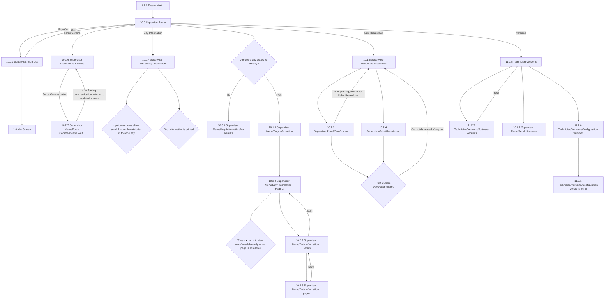

# Flow: Translink POS — Supervisor Menu

- Source: `knowledge/flows/translink-pos-full-transcription-v4.0.3.md`, board "11. 10.0 Supervisor"
  (Board Index entry "10.0 Supervisor"). Transcribed verbatim via the Claude Chrome extension,
  captured 2026-08-04; structured into this flow-map 2026-08-05.
- Project: translink   Device: POS   Feature: supervisor menu (day info/duty info, sale breakdown,
  force comms, versions, sign out)
- Transcription confidence: **high** for the Supervisor Menu's own screens/connections — verbatim,
  not summarized. **medium** for the "Technician/Versions" sub-branch reached from this menu (screen
  IDs are numbered under the `11.x` Technician scheme even though entered from Supervisor Menu — see
  Notes).

## Diagram

## Paths (each path = one candidate scenario)
| # | Path | Feature | Tags | Covered by |
|---|------|---------|------|------------|
| 1 | Present Supervisor card (or valid ID+PIN) → Sign On → Supervisor Menu displayed (current Operator signed off, device unlocked if needed) | supervisor | — | 4099913, 4099923 |
| 2 | Supervisor Menu → Sign Out → back to Supervisor Menu (cancel) | supervisor | — | 4105139 |
| 3 | Supervisor Menu → Sign Out → Idle Screen | supervisor | @destructive | 4099929 |
| 4 | Supervisor Menu → Force Comms → Force Comms button → Please Wait → returns to updated Force Comms screen | supervisor | — | 4099952 |
| 5 | Supervisor Menu → Day Information → duty list scrolls (up/down arrows) when more than 4 duties in the one day | supervisor | — | 4099948 |
| 6 | Supervisor Menu → Day Information → print → "Day Information is printed" | supervisor | — | 4099948 |
| 7 | Supervisor Menu → Duty Information available (Yes) → Duty Information list shown | supervisor | — | 4099947 |
| 8 | Supervisor Menu → Duty Information **not** available (No) → "Duty Information/No Results" | supervisor | @destructive | 4105140 |
| 9 | Duty Information → page 2 → 'Press ▲ or ▼ to view more' shown only when page is scrollable | supervisor | — | 4099947 |
| 10 | Duty Information Page 2 → select a duty → Duty Information - Details → page 2 of details → back to Details | supervisor | — | 4099947 |
| 11 | Supervisor Menu → Sale Breakdown → Print & Zero Current → confirm "Print Current Day/Accumulated" (Yes) → totals zeroed → returns to Sale Breakdown | supervisor | @destructive | 4099950 |
| 12 | Supervisor Menu → Sale Breakdown → Print & Zero Accumulated → confirm → totals zeroed → returns to Sale Breakdown | supervisor | @destructive | 4099950 |
| 13 | Sale Breakdown print confirmation → **No** → totals not zeroed | supervisor | @destructive | 4105141 |
| 14 | Supervisor Menu → Versions → Configuration Versions → Configuration Versions Scroll | supervisor | — | 4099951 |
| 15 | Supervisor Menu → Versions → Software Versions → back to Versions | supervisor | — | 4099951 |
| 16 | Supervisor Menu → Versions → Serial Numbers | supervisor | — | 4099951 |

## Screen states (Given/Then anchors)
- **Supervisor Menu (10.0)** — reached after Sign On with a valid Supervisor ID+PIN or Supervisor
  card; "User is able to navigate to the specific items in the menu by pressing the corresponding
  button." "Unless otherwise specified, the back button will take you back to the previous screen."
- **Sale Breakdown (10.1.5)** — "Selected any of the options will print the sales breakdown report."
  Both "Print and Zero Totals" and "Print and Zero Accumulated" first ask for confirmation; on Yes the
  totals are zeroed after print. Printout contents (per spec note): Operator number, POS number,
  Sign-on date/time, Sign-off date/time, No of tickets sold, Revenue collected, Miscellaneous revenue,
  No of smartcard validations, No of annulled tickets, First ticket number, Last ticket number,
  individual detail (ticket type and prices) of all tickets/passes issued that journey, individual
  ticket numbers of any annulled tickets that journey.
- **Force Comms (10.1.6)** — "Pressing the force comms button would trigger a check of the manifest
  in the back office and attempt to send audit files if they exist on the device. This would update
  the pending configuration files count and the pending audit files count. Refreshing the page will
  then update the count of these types of files to show how many of these items have been
  uploaded/downloaded." After forcing communication, user returns to the updated Force Comms screen.
- **Day Information (10.1.4)** — "Day information details are displayed with an option to print. The
  duty numbers will be sequential and increase by 1 each duty." Up/down arrows scroll if more than 4
  duties in one day.
- **Duty Information (10.1.3)** — reached only if the "Are there any duties to display?" decision
  resolves Yes; No routes to "Duty Information/No Results" (10.3.1). "User is able to select any of
  the duties by pressing corresponding button." "User is able to use the arrows buttons to scroll the
  list."
- **Duty Information - Page 2 (10.2.2)** — 'Press ▲ or ▼ to view more' shown only when the page is
  scrollable.
- **Duty Information - Details (10.2.2)** — "Details will be displayed, with print option." Has its
  own page 2 (10.2.5).
- **Versions (11.1.5, entered from Supervisor Menu)** — "Versions will show specific options"
  (Configuration Versions, Software Versions, Serial Numbers).
- **Sign Out (10.1.7)** — leads back to the Supervisor Menu (cancel) or to the Idle Screen (confirm).

## Notes / unknowns
- The board's own screen list gives the same ID **"10.2.2"** to two different screens — "Duty
  Information - Page 2" and "Duty Information - Details" — and the Connections section links both
  directions between them (`10.1.3 Duty Information → 10.2.2 ... Page 2`, then `10.2.2 ... Page 2 →
  10.2.2 ... Details`, then back). This is transcribed verbatim from the source; TODO: confirm with
  Overflow directly whether this is a source numbering error (one of the two should likely be a
  distinct ID, e.g. matching the "10.2.5 ... page2" companion for Details) or an intentional shared
  ID.
- **"Versions" (11.1.5) and its children (11.2.6 Configuration Versions, 11.2.7 Software Versions,
  11.3.1 Configuration Versions Scroll) are numbered under the `11.x` Technician scheme**, not `10.x`,
  even though the only connection into this sub-branch transcribed on this board is `10.0 Supervisor
  Menu → 11.1.5 Technician/Versions`. The Technician board (`## 12. 11.0 Technician`) also contains
  and links these same screen names — this looks like a menu option/screen genuinely shared between
  the Supervisor and Technician menus (same pattern as ETM's "Other Devices" screen shared between
  Driver Menu and Supervisor Menu). TODO: confirm whether Supervisor's "Versions" option and
  Technician's "Versions" option are the literal same screen instance or two distinct entry points
  that happen to share a name/number.
- **Serial Numbers (10.1.2)** is only reached, per this board's transcribed connections, via `11.1.5
  Technician/Versions → 10.1.2 Supervisor Menu/Serial Numbers` — i.e. through the Versions sub-branch,
  not directly off the main Supervisor Menu. No direct `10.0 Supervisor Menu → 10.1.2 Serial Numbers`
  connection is present in the source. TODO: confirm Serial Numbers is not also reachable directly
  from the Supervisor Menu (the ETM equivalent puts Serial Numbers directly under its own Versioning
  submenu, so this may just mirror that via the shared Versions screen).
- Entry into this board (Sign On with a Supervisor card/credentials) is transcribed here only via the
  connection `1.2.2 Please Wait... → 10.0 Supervisor Menu` plus the annotation "Presenting a Supervisor
  card when an operator is signed in will automatically sign off the operator and unlock the device,
  if needed. After sign on, POS will display Supervisor Menu screen." The full Sign On decision tree
  (empty fields, incorrect details, device locked, PIN entry) is already transcribed in
  `knowledge/flows/translink-pos-signon.md` — not re-transcribed here to avoid duplicating that file.
- Decision "Day Information is printed." is transcribed as a decision point in the source but the raw
  transcription gives no branch labels for it beyond the single downstream annotation "User will be
  able to print the details presented in the specific screen." TODO: confirm whether there is a
  print-success/print-error branch here (as seen elsewhere, e.g. ETM's shared FLU printer-error flow)
  that the Overflow board simply didn't spell out on this diagram.
