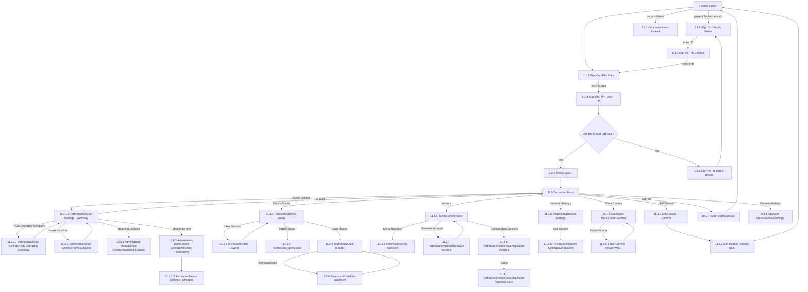

# Flow: Translink POS — Technician

- Source: `knowledge/flows/translink-pos-full-transcription-v4.0.3.md`, board "12. 11.0 Technician"
  (lines 2485-2618). Transcribed verbatim via the Claude Chrome extension, 2026-08-04. Structured
  into this flow map 2026-08-05.
- Project: translink   Device: POS   Feature: technician menu (device settings, device status,
  versions, network settings, force comms, soft reboot, sign out)
- Transcription confidence: **high** — verbatim, not summarized.

## Diagram

## Paths (each = one candidate scenario)
| # | Path | Feature | Tags | Covered by |
|---|---|---|---|---|
| 1 | Idle → present Technician card → ID auto-entered, PIN field active → enter PIN (4 digits) → valid → Please Wait → Technician Menu | technician | — | 4099913, 4100037, 4100038, 4100039, 4100040, 4100069 |
| 2 | Idle → present Technician card → enter PIN → **invalid** → Sign On - Incorrect Details → back to Empty Fields | technician | @destructive | 4099921, 4100043 |
| 3 | Idle → comms cannot be established → Communications Locked (device locked, "Notify a Supervisor or Technician") | technician | @destructive | 4099924, 4100041 |
| 4 | Technician Menu → Device Settings → Device Settings Summary → Go Back → Technician Menu | technician | — | 4105142 |
| 5 | Device Settings Summary → POS Operating Company → back to Summary | technician | — | 4100078 (screen only) |
| 6 | Device Settings Summary → Home Location → back to Summary | technician | — | 4099953, 4100076 |
| 7 | Device Settings Summary → Boarding Location (Administrator Mode screen, reused) | technician | — | 4099953, 4100084 |
| 8 | Device Settings Summary → Mounting Point/Active (Administrator Mode screen, reused) → Device Settings - Changes | technician | — | 4099953, 4100085, 4100070 |
| 9 | Technician Menu → Device Status → Other Devices → back to Device Status | technician | — | 4099959, 4100074, 4100079 |
| 10 | Device Status → Paper Status | technician | — | 4099959, 4100081, 4100384 |
| 11 | Device Status → Card Reader → present smartcard → Test Successful → Mini Statement → back to Card Reader | technician | — | FRAGMENTED — see consolidation-audit.md |
| 12 | Technician Menu → Versions → Serial Numbers | technician | — | 4099958, 4100082 |
| 13 | Versions → Software Versions → back to Versions | technician | — | 4099958, 4100067 |
| 14 | Versions → Configuration Versions → Down → Configuration Versions Scroll | technician | — | 4099958, 4100066, 4100068 |
| 15 | Technician Menu → Network Settings → Cell Modem | technician | — | 4099957, 4100077 |
| 16 | Technician Menu → Force Comms → Force Comms key → Force Comms - Please Wait → back to updated Force Comms screen | technician | — | 4099955, 4100083 |
| 17 | Technician Menu → Soft Reboot → Soft Reboot - Confirm → Soft Reboot - Please Wait → **Idle Screen** | technician | @destructive | 4099956, 4100072, 4100073 |
| 18 | Technician Menu → Sign Off → Supervisor/Sign Out → Idle Screen | technician | @destructive | 4099929, 4100057 |
| 19 | Technician Menu → Console Settings (Operator Menu/ConsoleSettings, reused screen) | technician | — | 4100087 |

## Screen states (Given/Then anchors)
- **Sign-on into Technician mode is card-triggered, not menu-triggered** — presenting a Technician
  card redirects straight to the Sign On screen with ID automatically entered and the PIN field
  active (per annotation), reusing the same Empty Fields / ID Entered / PIN Entry / PIN Entry - 4* /
  Incorrect Details screens as the standard Sign On flow (board "1.0 Sign On").
- **Communications Locked** — if the device cannot establish correct communication it becomes
  locked and shows an Error Message: "Please Notify a Supervisor or Technician" (same shared
  behaviour noted on the FLU boards for revenue-limit lockout).
- **Device Settings Summary reuses Administrator Mode screens** — "Boarding Location" and "Mounting
  Point/Active" are the same screens referenced from board "12.0 Administrator", reached here from
  Technician's own Device Settings Summary rather than a Technician-specific duplicate.
- **Device Status fans out to Other Devices / PaperStatus / Card Reader** — Other Devices explicitly
  returns to Device Status; Paper Status and Card Reader have no explicit "Go Back" connection
  captured in this board's connection list (see Notes).
- **Force Comms is a refresh loop** — pressing the Force Comms button triggers a manifest update
  check in the back office and attempts to send audit files; per annotation, this updates the
  pending configuration/audit file counts, and the user returns to the updated Force Comms screen
  afterward.
- **Soft Reboot lands on Idle Screen** — Soft Reboot - Confirm → Soft Reboot - Please Wait → Idle
  Screen, per annotation "After reboot, Idle screen will be presented."
- **Console Settings** (`9.3.1 Operator Menu/ConsoleSettings`) is a screen shared with the Operator
  Menu board, reached directly from the Technician Menu in this board's connection list.

## Notes / unknowns
- TODO: confirm the exact behaviour/destination for "11.1.1.2 Technician/Device Settings - Changes"
  — the source only shows it as the destination of the Mounting Point/Active connection with no
  onward connection captured; the annotation for a similar Confirm/Changes pattern elsewhere on this
  board says "Selecting 'Confirm' will trigger a device reboot," but that annotation is not
  explicitly linked to this exact screen in the connections list, so the reboot behaviour here is
  UNCONFIRMED rather than asserted.
- TODO: confirm "Go Back" destinations for Paper Status and Card Reader — the connections list shows
  Card Reader's "Test Successful" branch to Mini Statement and back, but no explicit "Go Back to
  Device Status" edge for either Paper Status or Card Reader (unlike Other Devices, which does have
  one). Not inventing a Go Back edge for either.
- Two items the raw transcription's extension classified as "Decision Points" are not branch
  decisions and are not represented as diagram nodes here — they read as spec notes:
  - "These settings will be configured in the back office via TMS" (re: Home Location / device
    settings, TMS-managed).
  - "The maintenance app will be capable of adjusting these settings and will be accessible from
    the technician mode. This will be provided at a later date." — **flagged as pending/future
    functionality**, same pattern as ETM Technician's "Decommissioning...pending design" note (see
    `translink-etm-technician.md`). TODO: confirm with the requirements owner whether any Technician
    Device Settings screens on POS should currently be treated as GAP/UNCONFIRMED rather than
    testable, before writing cases against them.
- This board is one cohesive whole (Technician Menu plus its direct sub-screens for device
  settings, device status, versions, network settings, force comms, soft reboot, and sign out) —
  kept as a single file, consistent with how `translink-etm-technician.md` and
  `translink-etm-supervisor-menu.md` were not split: Technician's sub-areas all hang directly off
  one root menu rather than forming genuinely separate feature flows.
- `Covered by` left as `?` throughout — a later `/audit-flows` pass fills these in against the live
  TestRail suite.
