# Flow: Translink POS — Top Up (Smartcard)

- Source: `knowledge/flows/translink-pos-full-transcription-v4.0.3.md`, board "8. 7.0 Top Up &
  Validation" (Board Index item "7. 7.0 Top Up & Validation"). Transcribed/structured 2026-08-05.
  This board bundles two genuinely distinct feature areas (Top Up of stored-value/period products,
  and Validation of discount/entitlement smartcards + faulty-card handling); split accordingly — this
  file covers **Top Up** only. See `translink-pos-topup-validation-validation.md` for the other half.
- Project: translink   Device: POS   Feature: smartcard top up (Ulsterbus Multi Journey, Metro
  Multi-Journey, Ulsterbus Travelcard, Metro Travelcard, ABT, DayLink, Belfast Visitor, iLink)
- Transcription confidence: **medium** — verbatim from the raw transcription, but the raw source
  contains several unlabeled decision nodes (Overflow object IDs with no text) and at least one
  screen-number collision (see Notes). Faithfully transcribed as found; not resolved or guessed.

## Diagram

```mermaid
flowchart TD
  R2["2.2 Main Screen-Rail selected"] --> PRESENT[7.1.1 Smartcard/Please Present Smartcard]
  UB25["2.5.2 Main Screen-Ulsterbus selected"] --> PRESENT
  RV3["3.0 Main Screen-Rail-v4"] --> PRESENT
  PRESENT --> VALID1{Is the Smartcard valid?}
  VALID1 -->|No| ERR51[7.5.1 Smartcard/Error]
  VALID1 -->|Yes, non-ABT card| MENU[7.2.1 Smartcard/Menu]
  VALID1 -->|Yes, ABT card| MENUABT[7.2.2 Smartcard/Menu-ABT]

  PRESENTM[7.1.2 Metro Smartcard/Please Present Smartcard] --> VALIDM{Is the Smartcard valid?}
  VALIDM -->|No| ERR51
  VALIDM -->|Yes| MENU

  MENU --> ADULT{Adult}
  MENU --> CHILD{Child}
  MENU --> MS1[7.3.2 Smartcard/Ulsterbus Multi Journey/Mini Statement]
  MENU --> MS2[7.3.3 Smartcard/Town Service Travelcard/Mini Statement]
  MENU --> MS3[7.3.4 Smartcard/Metro Multi Journey/Mini Statement]
  MENU --> MS4[7.3.5 Smartcard/Metro Travelcard/Mini Statement]
  MENU --> MS5[7.3.7 Smartcard/DayLink/Mini Statement]
  MENU --> MS6[7.3.8 Smartcard/Belfast Visitor Pass/Mini Statement]
  MENU --> MS7[7.3.9 Smartcard/iLink/Mini Statement]
  MS1 --> RETMENU1{"After printing process, user will automatically return to Top up menu."}
  MS2 --> RETMENU1
  MS3 --> RETMENU1
  MS4 --> RETMENU1
  MS5 --> RETMENU1
  MS6 --> RETMENU1
  MS7 --> RETMENU1

  MENUABT --> ADULTABT{Adult}
  MENUABT --> CHILDABT{Child}
  MENUABT --> MSABT[7.3.6 Smartcard/ABT/Mini Statement]
  MENUABT --> RECOVER{"Pressing 'Recover Unique Code' button will print a receipt with the Smartcard code on."}
  MENUABT --> CARDISSUE{"Card Issue flow"}
  MSABT --> RETMENUABT{"After printing process, user will automatically return to Top up menu."}
  NEGLIST["7.2.2.1 Smartcard/Menu-ABT/NegativeList (variant of 7.2.2)"]

  subgraph UBMJ["Ulsterbus Multi Journey"]
    ADULT -->|Multi journey| UB43[7.4.3 Ulsterbus Smartcard/Top Up]
    UB43 --> UB57[7.5.7 Ulsterbus Smartcard/Top Up/Basket]
    UB57 --> UBUNK1{"(unlabeled decision — Overflow id 6fc5065d)"}
    UB57 --> CWS1{Card Write Success?}
    UBUNK1 --> CWS1
    CWS1 -->|Yes| REMOVE1["7.5.3 Smartcard/Top Up/Remove Smartcard (Top up receipt printed)"]
    CWS1 -->|No| ERR61[7.6.1 Top Up/Top Up Error]
    REMOVE1 --> PRESENT
    REMOVE1 --> PRESENTM
  end

  subgraph MMJ["Metro Multi-Journey"]
    ADULT -->|Metro Multi-Journey| MJ31[7.3.1 Smartcard/Top Up]
    MJ31 --> MJ42[7.4.2 Smartcard/Top Up/Basket]
    MJ31 --> MENU
    MJ42 --> CWS2{Card Write Success?}
    CWS2 -->|Yes| REMOVE1
    CWS2 -->|No| ERR61
    ERR61 --> MJ42
  end

  subgraph MTC["Metro Travelcard"]
    ADULT -->|Metro Travelcard| FUMT{"Is the product FirstUse?"}
    FUMT --> EXPMT{"Is the product expired?"}
    FUMT --> NOTUSED[7.7.1 Top Up/Top Up Error Not Used]
    NOTUSED --> R2
    EXPMT -->|expired| MTCEXP[7.6.3 Smartcard/Top Up-Metro Travelcard-Expired]
    EXPMT -->|not expired| MTC45[7.4.5 Smartcard/Top Up-Metro Travelcard]
    MTCEXP --> MTBASKET[7.5.8 Smartcard/Top UpMetro Travelcard/Basket]
    MTC45 --> MTBASKET
    MTBASKET --> MTUNK{"(unlabeled decision — Overflow id aa826a0a)"}
    MTBASKET --> CWS3{Card Write Success?}
    MTUNK --> CWS3
    CWS3 -->|Yes| REMOVEEXP1["7.5.3 Smartcard/Top Up/Remove Smartcard/Expiry (Top up receipt printed)"]
    CWS3 -->|No| ERR61
    ERR61 --> MTBASKET
    REMOVEEXP1 --> PRESENT
  end

  subgraph UTC["Ulsterbus Travelcard (via 'Town Service Travelcard' branch)"]
    ADULT -->|Town Service Travelcard| FUUT{"Is the product FirstUse?"}
    FUUT --> EXPUT{"Is the product expired?"}
    FUUT --> NOTUSED
    EXPUT -->|expired| UTEXP[7.6.2 Smartcard/Top Up-Ulsterbus Travelcard-Expired]
    EXPUT -->|not expired| UT44[7.4.4 Smartcard/Top Up-Ulsterbus Travelcard]
    UTEXP --> UTBASKET[7.5.6 Smartcard/Top Up/Ulsterbus Travelcard/Basket]
    UT44 --> UTBASKET
    UTBASKET --> UTUNK{"(unlabeled decision — Overflow id 42b85ecc)"}
    UTBASKET --> CWS4{Card Write Success?}
    UTUNK --> CWS4
    CWS4 -->|Yes| REMOVEEXP1
    CWS4 -->|No| ERR61
    ERR61 --> UTBASKET
  end

  subgraph ABTFLOW["ABT"]
    ADULTABT -->|Adult| ABT46[7.4.6 ABT Smartcard/Top Up]
    ABT46 --> ABT58["7.5.8 Smartcard/Top Up/ABT/Basket/Expired (note: same '7.5.8' number as Metro Travelcard Basket in source)"]
    ABT46 --> MENUABT
    ABT58 -->|Bank Card| ABTUNK{"(unlabeled decision — Overflow id e6a4bd9a)"}
    ABT58 -->|Warrant| CWS5{Card Write Success?}
    CWS5 -->|No| ERR61
  end

  subgraph DAYLINK["DayLink"]
    ADULT -->|Adult, DayLink card| DL47[7.4.7 Smartcard/Top Up-Daylink]
    DL47 --> DL59[7.5.9 Smartcard/Top Up/Daylink/Payment]
    DL59 --> DLUNK{"(unlabeled decision — Overflow id 5412e25a)"}
    DL59 --> CWS6{Card Write Success?}
    DLUNK --> CWS6
    CWS6 -->|Yes| REMOVEDL["7.5.3 Smartcard/Top Up/Remove Smartcard/Daylink (Top up receipt printed)"]
    CWS6 -->|No| ERR61
    REMOVEDL --> RETSTART1{"Return to the beginning of the flow"}
  end

  subgraph BELFAST["Belfast Visitor Pass"]
    EXPBV{"Is the product expired?"} -->|expired| BV49[7.4.9 Smartcard/Top Up-Belfast Visitor/Expired]
    EXPBV -->|not expired| BV48[7.4.8 Smartcard/Top Up-Belfast Visitor]
    BV49 --> BV510[7.5.10 Smartcard/Top Up/Belfast Visitor/Payment]
    BV48 --> BV510
    BV510 --> BVUNK{"(unlabeled decision — Overflow id e086b0d1)"}
    BV510 --> CWS7{Card Write Success?}
    BVUNK --> CWS7
    CWS7 -->|Yes| REMOVEEXP1
    CWS7 -->|No| ERR61
    ERR61 --> BV510
    REMOVEEXP1 --> RETSTART2{"Return to the beginning of the flow"}
  end

  subgraph ILINK["iLink"]
    EXPIL{"Is the product expired?"} -->|expired| IL411[7.4.11 Smartcard/Top Up/iLink/Expired]
    EXPIL -->|not expired| IL410[7.4.10 Smartcard/Top Up/iLink]
    IL411 --> IL511[7.5.11 Smartcard/Top Up/iLink/Payment]
    IL410 --> IL511
    IL511 --> ILUNK{"(unlabeled decision — Overflow id f288076f)"}
    IL511 --> CWS8{Card Write Success?}
    ILUNK --> CWS8
    CWS8 -->|Yes| REMOVEEXP1
    CWS8 -->|No| ERR61
    ERR61 --> IL511
    REMOVEEXP1 --> RETSTART3{"Return to the beginning of the flow"}
  end
```

## Paths (each = one candidate scenario)
| # | Path | Feature | Tags | Covered by |
|---|------|---------|------|------------|
| 1 | Present Smartcard → invalid → Smartcard/Error (catch-all) | topup | @destructive | 4105143 |
| 2 | Present Smartcard → valid → Smartcard/Menu → Mini Statement (any of the 7 non-ABT card types) → auto-return to Top Up menu | topup | — | 4100017, 4100250, 4100251, 4100252, 4100253, 4100255, 4100256 |
| 3 | Present Smartcard (ABT) → valid → Smartcard/Menu-ABT → ABT Mini Statement → auto-return | topup | — | 4100254 (screen-validation only) |
| 4 | Smartcard/Menu-ABT → Recover Unique Code → receipt with Smartcard code printed | topup | — | 4105144 |
| 5 | Smartcard/Menu-ABT → Card Issue flow (hand-off to Issue Card board) | topup | — | 4105145 |
| 6 | Menu → Adult → Multi journey → Ulsterbus Smartcard/Top Up → Basket → Card Write Success → Remove Smartcard, receipt printed → back to Present Smartcard | topup | — | 4100392, 4104648, 4104649, 4100007 |
| 7 | Ulsterbus Multi Journey basket → Card Write **fails** → Top Up/Top Up Error | topup | @destructive | 4105157 |
| 8 | Menu → Adult → Metro Multi-Journey → Smartcard/Top Up → Basket → Card Write Success → Remove Smartcard, receipt printed | topup | — | 4100391 |
| 9 | Metro Multi-Journey basket → Card Write **fails** → Top Up Error → back to same basket screen | topup | @destructive | 4105154 |
| 10 | Menu → Adult → Metro Travelcard → FirstUse? → expired?/not-expired? → Metro Travelcard Basket → Card Write Success → Remove Smartcard/Expiry, receipt printed | topup | — | 4102562 |
| 11 | Menu → Adult → Metro Travelcard → FirstUse=Yes → Top Up Error Not Used → Main Screen-Rail selected | topup | @destructive | 4105155 |
| 12 | Metro Travelcard basket → Card Write **fails** → Top Up Error → back to basket | topup | @destructive | 4105156 |
| 13 | Menu → Adult → Town Service Travelcard → FirstUse?/expired? → Ulsterbus Travelcard (or -Expired) → Basket → Card Write Success → Remove Smartcard/Expiry, receipt printed | topup | — | 4102562 |
| 14 | Ulsterbus Travelcard basket → Card Write **fails** → Top Up Error → back to basket | topup | @destructive | 4105158 |
| 15 | Menu-ABT → Adult → ABT Smartcard/Top Up → ABT Basket/Expired → [Bank Card] path | topup | — | 4105146 |
| 16 | Menu-ABT → Adult → ABT Smartcard/Top Up → ABT Basket/Expired → [Warrant] Card Write Success? → **fails** → Top Up Error | topup | @destructive | 4105147 |
| 17 | Menu → Adult → DayLink → Top Up-Daylink → Daylink/Payment → Card Write Success → Remove Smartcard/Daylink, receipt printed → return to beginning of flow | topup | — | 4105148 |
| 18 | DayLink Payment → Card Write **fails** → Top Up Error | topup | @destructive | 4105149 |
| 19 | Menu → Belfast Visitor (expired or not) → Belfast Visitor Payment → Card Write Success → Remove Smartcard/Expiry, receipt printed → return to beginning of flow | topup | — | 4105150 |
| 20 | Belfast Visitor Payment → Card Write **fails** → Top Up Error → back to Payment screen | topup | @destructive | 4105151 |
| 21 | Menu → iLink (expired or not) → iLink Payment → Card Write Success → Remove Smartcard/Expiry, receipt printed → return to beginning of flow | topup | — | 4105152 |
| 22 | iLink Payment → Card Write **fails** → Top Up Error → back to Payment screen | topup | @destructive | 4105153 |

## Screen states (Given/Then anchors)
- **7.1.1 Smartcard/Please Present Smartcard** — reached from Main Screen-Rail selected (2.2),
  Main Screen-Ulsterbus selected (2.5.2), or Main Screen-Rail-v4 (3.0); user may choose 'Smartcard'
  at any given time from the Main Screen or either FLU screen.
- **7.1.2 Metro Smartcard/Please Present Smartcard** — the first screen a Metro operator sees after
  sign-on; functionally parallel to 7.1.1 for the Metro login.
- **7.5.1 Smartcard/Error** — catch-all error for an unrecognised/blank smartcard (e.g. not a
  Translink-format card); timeout of 3 seconds, or press-any-key, returns to Main Menu.
- **7.2.1 Smartcard/Menu** — presented once card validity is confirmed for non-ABT cards; offers
  Mini Statement and Top Up options; "Top up menu" is the destination named in the auto-return
  annotations.
- **7.2.2 Smartcard/Menu-ABT** — ABT-specific menu variant; text 'ABT' on screens is replaced by the
  ABT brand name. Also offers Recover Unique Code (prints a receipt with the Smartcard code) and a
  hand-off into the Card Issue flow.
- **Mini Statement screens** (7.3.2–7.3.9) — display data for the previously-presented smartcard; if
  the card has no card reference number, "N/A" is shown. All auto-return to the Top Up menu after
  printing.
- **Top Up basket/payment screens** — user chooses a product via the corresponding buttons; a
  product that would exceed the card's maximum allowed value is not displayed as an option. 'C'
  resets value/journeys number. Warrant and card payment are available for NIR/Ulsterbus; only cash
  is available for Metro users. Enter has no function on these screens.
- **Card Write Success? (all flows)** — Yes routes to a "Remove Smartcard" screen (receipt printed,
  user must remove the card to continue); No routes to **7.6.1 Top Up/Top Up Error**, where: (1) the
  cash/warrant payment is *not* recorded in POS audit data (a diagnostic/event records the error),
  and (2) any card-payment transaction is automatically voided by the POS (also recorded as a
  diagnostic/event).
- **7.7.1 Top Up/Top Up Error Not Used** — reached when the FirstUse check fails; routes back to
  **2.2 Main Screen-Rail selected**.
- **Multi-Journey expiry rule** — if a Multi-Journey card is expired and journeys are added to it,
  all existing journeys are removed following the successful top-up, and a journey-removal receipt
  is printed (Ulsterbus and Metro Multi-Journey both).

## Notes / unknowns
- The source contains several **unlabeled decision nodes** (Overflow objects exported with no text,
  only an internal id) feeding directly into `Card Write Success?` on the Ulsterbus Multi Journey,
  Metro Travelcard, Ulsterbus Travelcard, ABT, DayLink, Belfast Visitor, and iLink baskets/payment
  screens. Transcribed as `(unlabeled decision — Overflow id <id>)` rather than guessed. TODO:
  confirm with Overflow directly (or a re-export) what these nodes represent — likely a duplicate/
  stray connector rather than a real branch, but not assumed here.
- **Screen-number collision**: the raw transcription's Screens list gives the id **7.5.8** to *two*
  different screens — "Smartcard/Top UpMetro Travelcard/Basket" (Metro Travelcard flow) and
  "Smartcard/Top Up/ABT/Basket/Expired" (ABT flow). TODO: confirm whether this is a source numbering
  error or the id is genuinely shared/reused by design.
- **Town Service Travelcard branch**: the "Adult → Town Service Travelcard" decision is not a dead
  end — it feeds into the same "Is the product FirstUse?" / "Is the product expired?" chain that
  otherwise produces the **Ulsterbus Travelcard** screens (7.4.4 / 7.6.2). TODO: confirm this mapping
  (i.e. that "Town Service Travelcard" is the on-screen/product name for what the Ulsterbus
  Travelcard screens implement) — not invented, but the raw source doesn't state the equivalence in
  so many words, only implies it via the connection graph.
- **7.4.6.1 ABT Smartcard/Top Up/NegativeList** and **7.2.2.1 Smartcard/Menu-ABT/NegativeList** are
  listed in the Screens inventory and annotated as variants of 7.4.6 and 7.2.2 respectively ("Example
  of ABT card in negative list") but have no explicit connection edges in the raw source distinct
  from their parent screens. TODO: confirm the exact trigger condition/negative-list check that
  surfaces these variant screens.
- A trailing connection `7.5.3 Smartcard/Top Up/Remove Smartcard/Expiry → (unlabeled decision,
  Overflow id 60e3c3ad)` appears in the raw source with no further destination captured. TODO:
  confirm what (if anything) this leads to.
- The four annotation-only sub-types under Half-Fare Smartpass validation (Learning Disability, No
  Driving Licence, Partially Sighted, PIPS) belong to the companion **Validation** file, not this Top
  Up file — see `translink-pos-topup-validation-validation.md`.
