# Flow: Translink POS — Discount/Entitlement Validation & Faulty Cards

- Source: `knowledge/flows/translink-pos-full-transcription-v4.0.3.md`, board "8. 7.0 Top Up &
  Validation" (Board Index item "7. 7.0 Top Up & Validation"). Transcribed/structured 2026-08-05.
  This board bundles two genuinely distinct feature areas; split accordingly — this file covers
  **Validation of discount/entitlement smartcards** (free smartpasses, half-fare smartpasses, yLink,
  24+, Dependants Pass) plus the **Faulty Cards flow**. See `translink-pos-topup-validation-topup.md`
  for the smartcard Top Up half of the same board.
- Project: translink   Device: POS   Feature: discount/entitlement smartcard validation, faulty
  smartcard handling
- Transcription confidence: **medium-high** — verbatim from the raw transcription. A few sub-types
  (Learning Disability, No Driving Licence, Partially Sighted, PIPS) have no screens of their own in
  the raw source beyond the DLA ones they're audited under — flagged in Notes, not invented.

## Diagram

```mermaid
flowchart TD
  FREE{"Free Smartpasses"} --> SENIOR{"Senior Smartpass"}
  FREE --> SIXTY{"60+ Smartpass"}
  FREE --> ROI{"RoI Senior Smartpass"}
  FREE --> BLIND{"Blind Smartpass"}
  FREE --> WARPEN{"War Pensioner Smartpass"}

  SENIOR --> BUS91[7.9.1 Bus Main Screen-Senior Single]
  SENIOR --> RAIL93[7.9.3 Main Screen-Rail-Senior Single]
  BUS91 --> BUS92[7.9.2 Bus Main Screen-Senior Single-Alighting Selected]
  BUS92 --> TICKETPRINTED{"Ticket is printed."}
  RAIL93 --> TICKETPRINTED
  RAIL93 --> RAIL94[7.9.4 Main Screen-Rail-Senior Single Cross Border]
  RAIL94 --> TICKETPRINTED
  RAIL94 --> XBNOTE{"If operator sets a cross border journey, ticket type changes to Senior XB Single, changeable to Senior XB Day Return / Senior XB 1 Mth Return via R4 key + list, or L4 toggle key."}

  SIXTY --> TICKETPRINTED
  ROI --> TICKETPRINTED
  BLIND --> TICKETPRINTED
  WARPEN --> TICKETPRINTED

  TICKETPRINTED --> CONF000A[7.10.1 Main Screen-Validation-Confirmation-000]
  TICKETPRINTED --> CONF000B[7.10.2 Rail-Validation-Confirmation-000]

  HALFFARE{"Half-Fare Smartpass"} --> DLA{"Disability Living Allowance"}
  HALFFARE --> LEARNDIS{"Learning Disability"}
  HALFFARE --> NODL{"No Driving Licence"}
  HALFFARE --> PARTSIGHT{"Partially Sighted"}
  HALFFARE --> PIPS{"PIPS"}

  DLA --> BUS95[7.9.5 Bus Main Screen-DLA Single]
  DLA --> RAIL97[7.9.7 Main Screen-Rail-DLA Single]
  BUS95 --> BUS96[7.9.6 Bus Main Screen-DLA Single-Alighting Selected]
  BUS96 --> PAY98[7.9.8 Smartcard/Validation/DLA Single/Payment]
  RAIL97 --> PAY98
  PAY98 --> AFTERPAY{"After Payment flow is completed, the selected ticket is printed."}

  YLINK{"yLink"} --> BUS99[7.9.9 Bus Main Screen-yLink Single]
  YLINK --> BUS910[7.9.10 Bus Main Screen-yLink Single-Alighting Selected]
  YLINK --> RAIL911[7.9.11 Main Screen-Rail-yLink Single]
  BUS99 --> BUS910
  BUS910 --> PAY912[7.9.12 Smartcard/Validation/yLink Single/Payment]
  RAIL911 --> PAY912
  PAY912 --> AFTERPAY

  TWENTYFOURPLUS{"24+"} --> RAIL913[7.9.13 Main Screen-Rail-24+]
  RAIL913 --> PAY914[7.9.14 Smartcard/Validation/24+/Payment]
  PAY914 --> AFTERPAY

  DEPEND{"Dependants Pass"} --> BUS915[7.9.15 Bus Main Screen-Dependants Pass]
  DEPEND --> BUS916[7.9.16 Bus Main Screen-yLink Single-Dependants Pass]
  DEPEND --> RAIL917[7.9.17 Main Screen-Rail-Dependants Pass]
  BUS915 --> BUS916
  BUS916 --> SELTICKET{"The selected ticket is printed."}
  RAIL917 --> SELTICKET

  AFTERPAY --> CONFA[7.10.3 Main Screen-Validation-Confirmation]
  AFTERPAY --> CONFB[7.10.4 Rail-Validation-Confirmation]
  SELTICKET --> CONF000A
  SELTICKET --> CONF000B
  SELTICKET --> CONFB

  PRESENTCARD{"Customer presents card."} --> FAULTY{"Faulty Smartcard presented"}
  PRESENTCARD --> OUTSIDEBAND{"Smartcard presented outside of a relevant Time Band."}
  PRESENTCARD --> PASSBACK{"Passback of Smartcard/Smartpass"}
  PRESENTCARD --> HOTLISTED{"Hotlisted/Expired Card"}

  FAULTY --> F111[7.11.1 Smartcard - Faulty - Select Card Type]
  F111 --> F112[7.11.2 Smartcard - Faulty - Charge Full Fare]
  F111 --> F113[7.11.3 Smartcard - Faulty - Issue Ticket]
  F112 --> F111
  F113 --> F111
  F113 --> SEVENDAY{"7 Day Faulty Ticket is printed"}

  OUTSIDEBAND --> F114[7.11.4 Smartcard - Faulty - Outside Time Band]
  PASSBACK --> F115[7.11.5 FLU - Smartcard Already Validated]
  HOTLISTED --> F116[7.11.6 Hotlisted Error]
```

## Paths (each = one candidate scenario)
| # | Path | Feature | Tags | Covered by |
|---|------|---------|------|------------|
| 1 | Free Smartpasses → Senior Smartpass → Bus Main Screen-Senior Single → Alighting Selected → Ticket printed → Confirmation-000 | validation | — | 4100427, 4100283, 4100292, 4100235 |
| 2 | Free Smartpasses → Senior Smartpass → Main Screen-Rail-Senior Single → Ticket printed → Confirmation-000 | validation | — | 4100427, 4100293, 4100235/4100236 |
| 3 | Senior Smartpass → Rail → Cross Border screen → operator sets cross-border journey → ticket type changes to Senior XB Single (Day Return / 1 Mth Return selectable) → Ticket printed | validation | — | 4100427, 4100294 |
| 4 | Free Smartpasses → 60+ Smartpass → Ticket printed → Confirmation-000 | validation | — | 4104592 |
| 5 | Free Smartpasses → RoI Senior Smartpass → Ticket printed → Confirmation-000 | validation | — | 4104593 |
| 6 | Free Smartpasses → Blind Smartpass → Ticket printed → Confirmation-000 | validation | — | 4104594 |
| 7 | Free Smartpasses → War Pensioner Smartpass → Ticket printed → Confirmation-000 | validation | — | 4104595 |
| 8 | Half-Fare Smartpass → Disability Living Allowance → Bus (Main Screen-DLA Single → Alighting Selected) or Rail (Main Screen-Rail-DLA Single) → DLA Single/Payment → after payment, ticket printed | validation | — | 4104602, 4104607, 4100295, 4100296, 4100297, 4100298 |
| 9 | Half-Fare Smartpass → yLink → Bus (Main Screen-yLink Single → Alighting Selected) or Rail (Main Screen-Rail-yLink Single) → yLink Single/Payment → after payment, ticket printed | validation | — | 4104596, 4100415, 4100299, 4100284, 4100285, 4100286 |
| 10 | Half-Fare Smartpass → 24+ → Main Screen-Rail-24+ → 24+/Payment → after payment, ticket printed | validation | — | 4104597, 4100416, 4100287, 4100288 |
| 11 | Dependants Pass → Bus Main Screen-Dependants Pass → Bus Main Screen-yLink Single-Dependants Pass → selected ticket printed | validation | — | 4104603, 4100418, 4100289, 4100290 |
| 12 | Dependants Pass → Main Screen-Rail-Dependants Pass → selected ticket printed | validation | — | 4104603, 4100418, 4100291 |
| 13 | Customer presents faulty Smartcard → Faulty-Select Card Type → Charge Full Fare → back to Select Card Type | validation | @destructive | 4100022, 4100240 |
| 14 | Customer presents faulty Smartcard → Faulty-Select Card Type → Issue Ticket → 7 Day Faulty Ticket printed | validation | @destructive | 4100022, 4100241 |
| 15 | Customer presents Smartcard outside a relevant Time Band → Faulty-Outside Time Band error, 3s timeout / back to Main Screen or FLU | validation | @destructive | 4100021, 4100242 |
| 16 | Passback of Smartcard/Smartpass (re-validated too soon) → FLU-Smartcard Already Validated error, 3s timeout / back to Main Screen or FLU | validation | @destructive | 4100019, 4100243, 4102560 |
| 17 | Hotlisted or expired card presented → Hotlisted Error (states "Expired Smartcard" if expired), 3s timeout / back to Main Screen or FLU | validation | @destructive | 4100020, 4100244 |

## Screen states (Given/Then anchors)
- **Free Smartpasses** — Senior, 60+, RoI Senior, Blind, War Pensioner all follow the same shape as
  Senior Smartpass (per annotation: "Similar to the Senior Smartpass"), but the raw source only
  captures distinct screen nodes for the Senior variant; the others connect straight to the shared
  "Ticket is printed." decision with no screen node of their own in this export.
- **Cross Border (Rail only)** — several ticket types are explicitly stated as **not** accepted for
  Rail Cross Border travel (Cross Border stations aren't offered for numerical input); Senior,
  Blind, and War Pensioner are the types shown as gaining an XB variant (XB Single / XB Day Return /
  XB 1 Mth Return, chosen via R4 key + list or L4 toggle).
- **Half-Fare Smartpass sub-types** — although displayed on-screen as "Half Fare" and printed as such
  on the ticket, Learning Disability, No Driving Licence, Partially Sighted, and PIPS are **audited**
  as their own sub-type (not generically as "Half Fare"), per annotation. Only DLA has explicit
  screen nodes in this export.
- **Faulty Cards flow entry** — "Customer presents card." fans out to four mutually-exclusive
  outcomes: Faulty Smartcard presented, presented outside a relevant Time Band, Passback (re-used too
  soon after a prior validation — the exact re-validation window is configurable "to TL demand"),
  and Hotlisted/Expired. All three error screens (Outside Time Band, Already Validated, Hotlisted
  Error) share a 3-second timeout that returns the operator to the Main Screen or FLU screen where
  they started.
- **7.11.1 Smartcard - Faulty - Select Card Type** — offers Charge Full Fare and Issue Ticket, both
  of which loop back to this screen; Issue Ticket additionally prints a 7 Day Faulty Ticket.
- **Operator control retained** — for DLA, yLink, and Dependants Pass validation flows, the operator
  can still change boarding/alighting station after the ticket type is set by presenting the smartpass,
  without needing to remove the card.

## Notes / unknowns
- TODO: confirm whether 60+ Smartpass / RoI Senior Smartpass / Blind Smartpass / War Pensioner
  Smartpass genuinely have **no** dedicated screen (going straight to "Ticket is printed.") or
  whether the raw Overflow export simply didn't surface screen nodes already covered by the Senior
  Smartpass path. Not invented either way — transcribed exactly as connected in the source.
- TODO: confirm whether Learning Disability / No Driving Licence / Partially Sighted / PIPS truly
  reuse the DLA screens (7.9.5–7.9.8) one-for-one, or whether they have their own screens that simply
  weren't captured as distinct nodes in this export.
- TODO: confirm the configurable re-validation window referenced for the Passback error ("less than
  X minutes... configured to TL demand") — no default value is given in this board.
- The `Ticket is printed.` decision routes to **both** 7.10.1 and 7.10.2 (the "-000" confirmation
  variants); `After Payment...is printed.` and `The selected ticket is printed.` route to a mix of
  7.10.1/7.10.2/7.10.3/7.10.4 depending on flow, exactly as connected in the raw source — the pairing
  logic (which confirmation screen for which ticket type) is not stated explicitly beyond the wiring
  shown in the diagram above.
