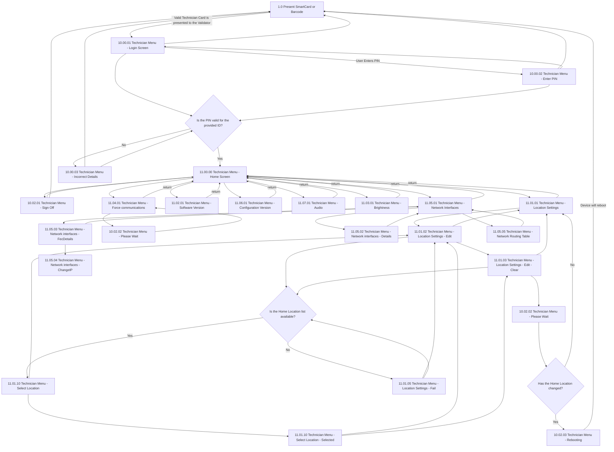

# Flow: Translink PV — Technician Menu

- Source: `knowledge/flows/translink-validators-gv-pv-bv-full-transcription-v3.1.7.md`, board
  "5. Technician Menu - Platform Validator" (Board Index item 5). Transcribed verbatim via the
  Claude Chrome extension. Transcription/structuring date: 2026-08-05.
- Project: translink   Device: PV   Feature: technician menu (sign-on, location settings, network
  interfaces, versions, audio, brightness, force communications, sign off)
- Transcription confidence: **high** — verbatim, not summarized.

## Diagram

> Note on the `-->|return|` edges: the raw transcription lists the target of these edges as a
> **Decision** node literally named "11.00.00 Technician Menu - Home Screen" (repeated once per
> source screen — Software Version, Location Settings, Brightness, Force communications, Audio,
> Configuration Version, Network Interfaces all point to a same-named "Decision"). This reads as a
> transcription/tool artefact (Home Screen is a screen, not a decision, elsewhere in the same
> board) rather than six/seven genuinely distinct decision points, so it is drawn here as a single
> `HOME` screen target. See Notes/unknowns.

## Paths (each path = one candidate scenario)
| # | Path | Feature | Tags | Covered by |
|---|------|---------|------|------------|
| 1 | Present SmartCard/Barcode → valid Technician Card → Login Screen → Enter PIN → PIN valid → Home Screen | tech-menu-signon | — | 4101011, 4101076 |
| 2 | Login Screen → Enter PIN → PIN invalid → Incorrect Details → back to Present SmartCard/Barcode | tech-menu-signon | @destructive | 4101011 |
| 3 | Incorrect Details → retry PIN check (loop back to PIN valid? decision) | tech-menu-signon | @destructive | 4105413 |
| 4 | Login Screen → back to Present SmartCard/Barcode (abandon sign-on) | tech-menu-signon | — | 4105414 |
| 5 | Enter PIN → back to Login Screen (abandon PIN entry) | tech-menu-signon | — | 4105415 |
| 6 | Home Screen → Sign Off → Home Screen | tech-menu-signon | — | 4105416 |
| 7 | Home Screen → Sign Off → Present SmartCard/Barcode | tech-menu-signon | — | 4102166 |
| 8 | Home Screen → Location Settings → Edit → Clear → Home Location list available → Select Location → Selected → Edit → Clear → Please Wait → Home Location changed → Yes → Rebooting → device reboots → Present SmartCard/Barcode | tech-menu-location | @destructive | 4101012 |
| 9 | Location Settings → Edit → Clear → Home Location list available → No → Location Settings - Fail → back to Edit | tech-menu-location | @destructive | 4101012 |
| 10 | Please Wait → Has Home Location changed? → No → back to Location Settings (no reboot) | tech-menu-location | — | 4105417 |
| 11 | Location Settings → Edit → back to Location Settings (no change made) | tech-menu-location | — | 4105418 |
| 12 | Home Screen → Software Version → back to Home Screen | tech-menu-versions | — | 4101014 |
| 13 | Home Screen → Configuration Version → back to Home Screen | tech-menu-versions | — | 4101014 |
| 14 | Home Screen → Audio → back to Home Screen | tech-menu-settings | — | 4102168 |
| 15 | Home Screen → Brightness → back to Home Screen | tech-menu-settings | — | 4101013 |
| 16 | Home Screen → Force communications → Please Wait → Force communications (Call Now / Refresh) → back to Home Screen | tech-menu-comms | — | 4101015 |
| 17 | Home Screen → Network Interfaces → Details → back to Network Interfaces | tech-menu-network | — | 4101016, 4101064, 4101065 |
| 18 | Network Interfaces → FecDetails → ChangeIP | tech-menu-network | — | 4101016, 4101066, 4101067 |
| 19 | Network Interfaces → FecDetails → back to Network Interfaces | tech-menu-network | — | 4101016, 4101066 |
| 20 | Network Interfaces → Routing Table → back to Network Interfaces | tech-menu-network | — | 4101016, 4101068 |
| 21 | Network Interfaces → back to Home Screen | tech-menu-network | — | 4101016 |

## Screen states (Given/Then anchors)
- **1.0 Present SmartCard or Barcode** — entry point; presenting a Technician card redirects the
  user to the Login Screen with the ID automatically entered and the PIN field active.
- **10.00.01 Technician Menu - Login Screen** — technician ID entry; leads to PIN entry.
- **10.00.02 Technician Menu - Enter PIN** — PIN entry; feeds the "Is the PIN valid for the provided
  ID?" decision.
- **10.00.03 Technician Menu - Incorrect Details** — shown on PIN validation failure; "The error
  message will disappear after a short timeout."
- **11.00.00 Technician Menu - Home Screen** — technician menu hub; routes to Location Settings,
  Software Version, Configuration Version, Audio, Brightness, Force communications, Network
  Interfaces, and Sign Off.
- **10.02.01 Technician Menu - Sign Off** — sign-off screen; both a return to Home Screen and a
  return to Present SmartCard/Barcode are present in the source connections (see Notes).
- **11.01.01 Technician Menu - Location Settings** — Location Settings landing screen.
- **11.01.02 Technician Menu - Location Settings - Edit** — Edit mode: user presses "Change" to
  enter/edit values; "Stop Location", "Install Point ID" and "Mount ID" are configured by selecting
  the relevant field and entering a number via the on-screen pin-pad. To change the Home Location
  the user presses "Select" and chooses from a list of available Home Locations provided on request
  from the BackOffice. Selecting a new Home Location requires a reboot to perform the update.
- **11.01.03 Technician Menu - Location Settings - Edit - Clear** — clear-values state within Edit.
- **11.01.05 Technician Menu - Location Settings - Fail** — shown when the Home Location list is
  not available.
- **11.01.10 Technician Menu - Select Location** — list of available Home Locations (from
  BackOffice).
- **11.01.10 Technician Menu - Select Location - Selected** — location selected from the list.
- **10.02.02 Technician Menu - Please Wait** — interstitial wait state, reused by both the Location
  Settings reboot-check flow and the Force communications flow.
- **10.02.03 Technician Menu - Rebooting** — shown when the Home Location has changed and the device
  reboots to apply it; leads back to Present SmartCard/Barcode.
- **11.02.01 Technician Menu - Software Version** — Software Versions screen.
- **11.06.01 Technician Menu - Configuration Version** — Configuration Versions screen.
- **11.07.01 Technician Menu - Audio** — Audio settings screen.
- **11.03.01 Technician Menu - Brightness** — allows the technician to adjust PV screen brightness;
  the displayed "Mode" indicates whether brightness is configured manually or set to automatically
  adapt to environmental light via the built-in light sensor.
- **11.04.01 Technician Menu - Force communications** — summarizes: (1) how many Audit Records are
  pending delivery to the back office, (2) the last date/time an Audit Record was successfully sent,
  (3) the last date/time a manifest download was attempted, (4) the last date/time a manifest
  download was successful, (5) a count of pending files to download for software/configuration
  updates. "Call Now" triggers a manifest check at the back office and attempts to send pending
  audit records. "Refresh" updates the displayed values with the most recent information.
- **11.05.01 Technician Menu - Network Interfaces** — network interfaces landing screen; routes to
  Details, FecDetails, and Routing Table.
- **11.05.02 Technician Menu - Network interfaces - Details** — per-interface details.
- **11.05.03 Technician Menu - Network interfaces - FecDetails** — FEC-specific interface details;
  routes to ChangeIP.
- **11.05.04 Technician Menu - Network interfaces -ChangeIP** — change-IP screen for the FEC
  interface (transcription's exact spacing/hyphenation preserved: "ChangeIP" with no leading space).
- **11.05.05 Technician Menu - Network Routing Table** — routing table screen.

## Notes / unknowns
- TODO: confirm whether "Sign Off → Home Screen" and "Sign Off → Present SmartCard/Barcode" are two
  genuinely distinct outcomes of the same Sign Off screen (e.g. cancel vs confirm) or a transcription
  duplicate — the raw source lists both connections with no distinguishing trigger label.
- TODO: confirm the semantics of the six/seven `-->|return|` edges (Software Version, Location
  Settings, Brightness, Force communications, Audio, Configuration Version, Network Interfaces, each
  → Home Screen). In the raw transcription these are each recorded as a connection to a **Decision**
  node literally named "11.00.00 Technician Menu - Home Screen", not to the Home Screen **screen**
  node used elsewhere on the same board. This flow-map treats them as plain returns to the Home
  Screen; if Overflow intends an actual decision gate at each of those points, that gate's branches
  are not present anywhere in the raw transcription and would need re-checking against the live
  Overflow board.
- TODO: confirm the actual trigger/condition for "Location Settings - Edit → Location Settings -
  Edit - Clear" and "Select Location - Selected → Location Settings - Edit - Clear" — the raw
  transcription lists the connection with no action label.
- The annotation "Location Settings" and "Network Settings" appear in the raw source as bare
  one-line heading annotations (section titles rather than behaviour notes); not repeated verbatim
  as separate spec text here beyond their use as screen-state section headers above.
- This board (source Board Index item 5, "Technician Menu - Platform Validator") is a single
  cohesive technician-menu flow — sign-on, location settings, versions, audio, brightness, force
  communications, network interfaces, sign off all interlink through one shared Home Screen hub — so
  it is kept as one file, unlike the ETM FLU/Driver Menu boards which split into genuinely separate
  feature files.
- Two further boards exist in the same raw transcription file under "Additional Boards" —
  "Platform Validator (extra/archived board)" (tap-in/tag screens: card presentment, error/decline
  screens, ABT/passback flows) and "Gate Validator (extra/archived board)" — both explicitly marked
  archived/draft and are **out of scope for this file**, which covers only the Technician Menu board.
  They are candidates for separate flow-maps if/when needed.
