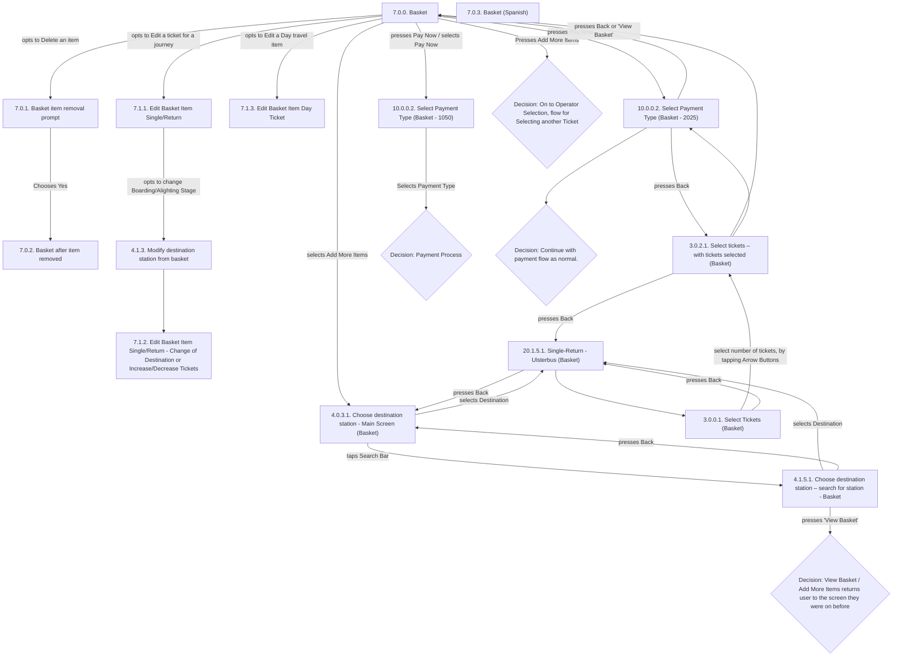

# Flow: Translink TVM — Basket

- Source: knowledge/flows/translink-tvm-full-transcription-v3.4.4.md, board "13. Basket" (Board
  Index item 13 of 15). Transcribed/structured 2026-08-05.
- Project: translink   Device: TVM   Feature: basket (view/edit basket items, add more items, pay now)
- Transcription confidence: **medium** — source connections faithfully transcribed, but two screens
  share the identical label "10.0.0.2. Select Payment Type" distinguished only by a trailing
  "(Basket - 1050)" / "(Basket - 2025)" suffix of unclear meaning, and a few edges have no
  action/trigger label in the source. See Notes/unknowns.

## Diagram

## Paths (each path = one candidate scenario)
| # | Path | Feature | Tags | Covered by |
|---|------|---------|------|------------|
| 1 | Basket → Edit a ticket for a journey → Edit Basket Item Single/Return | basket | — | 4105303 |
| 2 | Edit Basket Item Single/Return → change Boarding/Alighting Stage → Modify destination station from basket → Edit Basket Item Single/Return - Change of Destination/Increase-Decrease Tickets | basket | — | C4103712, C4103713 |
| 3 | Basket → Edit a Day travel item → Edit Basket Item Day Ticket | basket | — | 4105304 |
| 4 | Basket → Delete an item → Basket item removal prompt → Yes → Basket after item removed | basket | @destructive | C4103709, C4103710, C4103711 |
| 5 | Basket → Pay Now → Select Payment Type (Basket - 1050) → Selects Payment Type → Payment Process | basket | — | 4105305 |
| 6 | Basket → Pay Now → Select Payment Type (Basket - 2025) → Continue with payment flow as normal. | basket | — | 4105306 |
| 7 | Select Payment Type (Basket - 2025) → Back → Select tickets – with tickets selected (Basket) | basket | — | 4105307 |
| 8 | Select Payment Type (Basket - 2025) → Back or 'View Basket' → Basket | basket | — | 4105308 |
| 9 | Basket → Add More Items → Choose destination station - Main Screen (Basket) | basket | — | 4105309 |
| 10 | Basket → Add More Items → "On to Operator Selection, flow for Selecting another Ticket" | basket | — | 4105310 |
| 11 | Choose destination station - Main Screen (Basket) → selects Destination → Single-Return - Ulsterbus (Basket) | basket | — | 4105311 |
| 12 | Choose destination station - Main Screen (Basket) → taps Search Bar → Choose destination station – search for station - Basket | basket | — | 4105312 |
| 13 | Choose destination station – search for station - Basket → selects Destination → Single-Return - Ulsterbus (Basket) | basket | — | 4105313 |
| 14 | Choose destination station – search for station - Basket → presses Back → Choose destination station - Main Screen (Basket) | basket | — | 4105314 |
| 15 | Choose destination station – search for station - Basket → presses 'View Basket' → returns to the screen the user was on before (universal View Basket/Add More Items rule) | basket | — | 4105315 |
| 16 | Single-Return - Ulsterbus (Basket) → Select Tickets (Basket) | basket | — | 4105316 |
| 17 | Single-Return - Ulsterbus (Basket) → presses Back → Choose destination station - Main Screen (Basket) | basket | — | 4105317 |
| 18 | Select Tickets (Basket) → selects number of tickets via Arrow Buttons → Select tickets – with tickets selected (Basket) | basket | — | 4105318 |
| 19 | Select Tickets (Basket) → presses Back → Single-Return - Ulsterbus (Basket) | basket | — | 4105319 |
| 20 | Select tickets – with tickets selected (Basket) → presses Back → Single-Return - Ulsterbus (Basket) | basket | — | 4105320 |
| 21 | Select tickets – with tickets selected (Basket) → Basket (trigger not labelled in source — see Notes) | basket | — | 4105321 |
| 22 | Select tickets – with tickets selected (Basket) → Select Payment Type (Basket - 2025) (trigger not labelled in source — see Notes) | basket | — | 4105322 |
| 23 | User presses Cancel while items are in the basket → returns to Home Screen → all basket items removed | basket | @destructive | 4105323 |

## Screen states (Given/Then anchors)
- **7.0.0. Basket** — the landing screen after "Add To Basket" is pressed from any ticket-selection
  flow. Offers Edit / Delete per item, 'Add More Items', and 'Pay Now'. "Pay Now" and "Add to Basket"
  buttons are faded out/unavailable elsewhere until a ticket count is selected (per board 3's own
  screen notes, referenced from Basket's precondition).
- **7.0.3. Basket (Spanish)** — localised variant of the Basket screen. In languages other than
  English, a pencil symbol appears on the 'Edit' button. No outgoing/incoming connections are listed
  for this screen in the source (see Notes/unknowns).
- **7.0.1. Basket item removal prompt** — confirmation dialog shown after the user opts to delete an
  item; 'Yes' leads to "7.0.2. Basket after item removed".
- **7.0.2. Basket after item removed** — Basket state immediately after an item is deleted.
- **7.1.1. Edit Basket Item Single/Return** — lets the user change destination, departing point,
  and/or number of tickets for a Single/Return item; 'Done' returns to Basket. Opting to change the
  Boarding/Alighting Stage routes to "4.1.3. Modify destination station from basket".
- **7.1.2. Edit Basket Item Single/Return - Change of Destination or Increase/Decrease Tickets** —
  reached from "4.1.3. Modify destination station from basket".
- **7.1.3. Edit Basket Item Day Ticket** — lets the user change number of tickets, press 'Done' to
  return to Basket. User can also change number of tickets by tapping up/down arrows.
- **4.0.3.1. Choose destination station - Main Screen (Basket)** — reached from Basket via 'Add More
  Items'. Synthesized speech: "Speech 10 – Choose from popular destinations or search for another
  destination".
- **4.1.3. Modify destination station from basket** — intermediate screen for changing
  Boarding/Alighting Stage from an existing basket item.
- **4.1.5.1. Choose destination station – search for station - Basket** — search variant of the
  destination-selection screen, reached by tapping the Search Bar from the Main Screen variant.
- **20.1.5.1. Single-Return - Ulsterbus (Basket)** — ticket-type screen reached after destination
  selection; back-navigates to the destination-selection screen it came from.
- **3.0.0.1. Select Tickets (Basket)** / **3.0.2.1. Select tickets – with tickets selected (Basket)**
  — ticket-count selection screens, mirroring the equivalent screens in board 5 (Buy Tickets) but in
  the basket-editing context.
- **10.0.0.2. Select Payment Type (Basket - 1050)** / **10.0.0.2. Select Payment Type (Basket -
  2025)** — two distinct labelled variants of the payment-type screen reached from Basket's 'Pay
  Now'/'Selects Pay Now'; synthesized speech: "Speech 3 – Please select Payment type" (noted against
  both variants). See Notes/unknowns re: the "1050"/"2025" suffix.

## Notes / unknowns
- TODO: confirm what distinguishes "10.0.0.2. Select Payment Type (Basket - 1050)" from "10.0.0.2.
  Select Payment Type (Basket - 2025)" — the source lists them as separate screens/connections with
  identical titles but different bracketed numeric suffixes (possibly a screen-ID/version artifact
  from the Overflow export, or two configurable variants). Do not assume they are the same screen.
- TODO: confirm the trigger for "Select tickets – with tickets selected (Basket) → Basket" (path 21)
  and "Select tickets – with tickets selected (Basket) → Select Payment Type (Basket - 2025)" (path
  22) — both connections are listed in the source with no bracketed action/condition label.
- TODO: confirm the destination of "Basket → Add More Items" — the source lists **two** separate
  connections both triggered by "User Presses/Selects 'Add More Items'" from the same Basket screen:
  one to "4.0.3.1. Choose destination station - Main Screen (Basket)" (path 9) and one to the
  decision "On to Operator Selection, flow for Selecting another Ticket" (path 10). It is unclear from
  this board alone whether these are the same outcome described twice, alternative outcomes depending
  on basket contents, or one is stale/superseded — cross-check against board 6 (Destination and
  Boarding Selection) if resolving this matters for coverage.
- The "Basket shows, when the user clicks 'Add More Items', the user is returned precisely to the
  screen they were on before. This is the same for the 'View Basket' Button on all other screens,
  hence is not marked on the flow repeatedly" decision point is a **general rule**, not a single
  concrete transition — the source only draws one explicit edge to it (from the destination-search
  screen, path 15). Per the rule's own text, 'View Basket'/'Add More Items' elsewhere in the app also
  return to the prior screen, but those individual edges are intentionally not drawn in the source
  board and are therefore not fabricated here.
- "7.0.3. Basket (Spanish)" has no incoming or outgoing connections listed anywhere in this board's
  "Connections / Flow" section — it appears only in the Screens list. TODO: confirm whether it's
  reached via a language-setting toggle from "7.0.0. Basket" (implied by the annotation about the
  pencil symbol) or via a separate mechanism not captured in this board.
- Cancellation behaviour ("Pressing cancel while items are in the basket will return the user to the
  home screen. All items in the basket are removed.") is stated only as a standalone annotation, with
  no explicit screen-to-screen connection drawn for it in the source — represented here as path 23,
  sourced from the annotation text.
- Two duplicate "Continue with payment flow as normal." decision points and two identically-titled
  "10.0.0.2. Select Payment Type (Basket - 2025)" screen entries appear in the raw transcription's
  Screens/Decision Points lists; treated as the same node each (not double-counted) per the
  transcription's own repeated connections referencing them.
