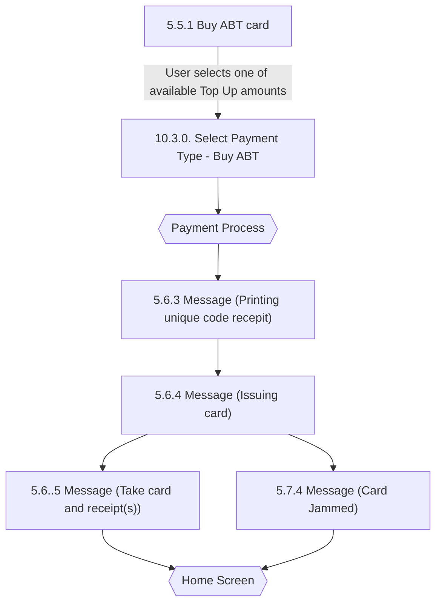

# Flow: Translink TVM — Buy ABT Card

- Source: `knowledge/flows/translink-tvm-full-transcription-v3.4.4.md`, board "8. Buy ABT Card".
  Transcribed 2026-08-05.
- Project: translink   Device: TVM   Feature: buy ABT card (top-up / issue new ABT card, cash/card payment)
- Transcription confidence: **high** — verbatim from the transcription source, board is small and
  self-contained (6 screens, 2 decision points, 8 connections). Not split — single coherent feature area.

## Diagram

## Paths (each path = one candidate scenario)
| # | Path | Feature | Tags | Covered by |
|---|------|---------|------|------------|
| 1 | Buy ABT card → select Top Up amount → Select Payment Type - Buy ABT → Payment Process → Printing unique code receipt → Issuing card → Take card and receipt(s) → Home Screen | buy-abt-card | — | 4105324 |
| 2 | Buy ABT card → select Top Up amount → Select Payment Type - Buy ABT → Payment Process → Printing unique code receipt → Issuing card → **Card Jammed** → Home Screen | buy-abt-card | @destructive | 4105325 |

## Screen states (Given/Then anchors)
- **5.5.1 Buy ABT card** — presents pre-configured Top-Up amounts for selection.
- **10.3.0. Select Payment Type - Buy ABT** — payment type selection specific to Buy ABT, leads into
  the shared "Payment Process" decision.
- **5.6.3 Message (Printing unique code recepit)** — TVM always prints a special unique code receipt
  for a Buy ABT transaction (per annotation, this step is not skippable/toggleable, unlike the
  Smartcards board's optional top-up receipt).
- **5.6.4 Message (Issuing card)** — card is being issued; branches to either the jam message or the
  take-card-and-receipt(s) message.
- **5.7.4 Message (Card Jammed)** — card jam during issuing; routes to Home Screen.
- **5.6..5 Message (Take card and receipt(s))** — normal completion; user can press Done to go to Home
  Screen, or the screen counts down to Home Screen on timeout (per annotation).

## Notes / unknowns
- The source transcription's own screen-name typos are preserved verbatim (`5.6..5`, "recepit") to
  match the raw source exactly — do not silently "fix" these when cross-referencing other files.
- TODO: confirm whether "Card Jammed" is reached only from "Issuing card" as a failure branch of that
  same step, or whether it can also be reached from elsewhere on this board — the source only lists
  the single connection `Issuing card → Card Jammed` with no labelled condition, so the success/jam
  branch trigger itself is not stated (no annotation names what determines which path is taken from
  "Issuing card").
- TODO: confirm what "Payment Process" resolves to for this flow specifically (e.g. cash vs.
  card/contactless outcomes) — the Buy ABT Card board reuses "Payment Process" as a decision point but
  does not itself detail its branches; those are documented on the separate "11. Payment Process" board,
  out of scope for this file.
- The board's "Home Screen" decision point is likewise a cross-board junction (also used by the
  Smartcards board) rather than something detailed here — no branch labels are given on this board for
  it.
- No Metro/Ulsterbus/Rail or Bus/Rail TVM-mode branching is present on this board.
