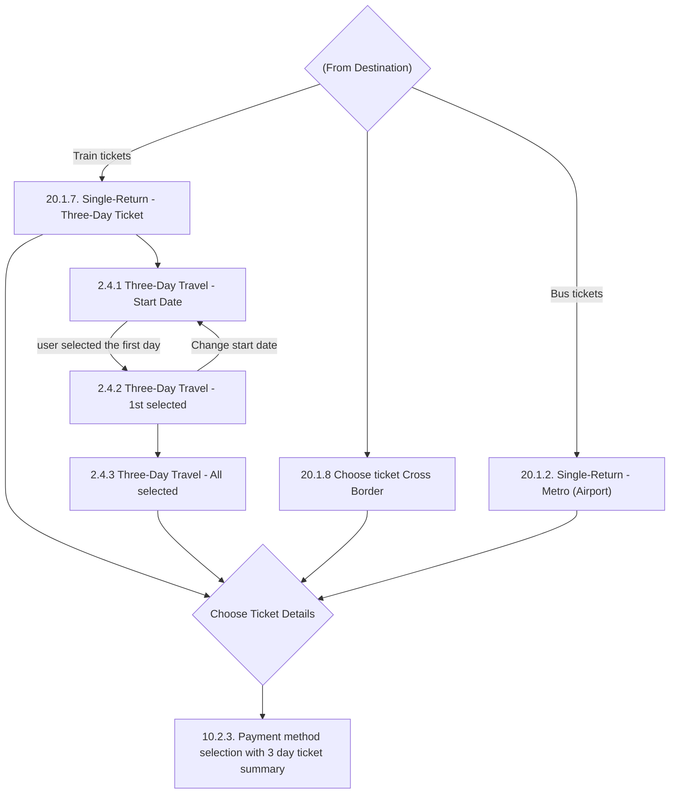

# Flow: Translink TVM — Buy Tickets

- Source: `knowledge/flows/translink-tvm-full-transcription-v3.4.4.md`, board "5. Buy Tickets".
  Transcribed verbatim via the Claude Chrome extension. Transcription/structuring date: 2026-08-05.
- Project: translink   Device: TVM   Feature: buy tickets (ticket type selection incl. Three-Day
  Travel and Cross Border flows)
- Transcription confidence: **high** — verbatim, not summarized.

## Diagram

## Paths (each path = one candidate scenario)
| # | Path | Feature | Tags | Covered by |
|---|------|---------|------|------------|
| 1 | (From Destination) → Train tickets → Three-Day Ticket screen → Choose Ticket Details → Payment method selection (3-day summary) | buy-tickets | — | C4103694, C4104868, C4104869 |
| 2 | (From Destination) → Train tickets → Three-Day Ticket screen → Three-Day Travel Start Date → select 1st day → 1st selected → select remaining days → All selected → Choose Ticket Details → Payment method selection | buy-tickets | — | C4103694, C4104868, C4104869, C4103695 |
| 3 | Three-Day Travel - 1st selected → 'Change start date' → back to Three-Day Travel - Start Date with no date selected | buy-tickets | — | 4105326 |
| 4 | (From Destination) → Choose ticket Cross Border → Choose Ticket Details → Payment method selection | buy-tickets | — | C4103599(N/A - not TVM), C4103793(N/A); actually: Cross-Border Adult single/Day Return/1st Class Single/Weekly/Monthly/1 Month Return/1st Class 1 Month Return cash|card|contactless cases, NI Rail Adult single/Day Return/3-Day Select/Senior/ROI Senior/Blind/War Pensioner/60+ concessionary/Weekly/Monthly/1/3-off Day Return/Day Tracker cash|card|contactless cases (all in section 'Functional / Sales - Tickets / Rail & Cross-Border (Kiosk)') |
| 5 | (From Destination) → Bus tickets → Single-Return - Metro (Airport) → Choose Ticket Details → Payment method selection | buy-tickets | — | Metro Adult Single ticket-issuance cases (e.g. the ones asserting 'the customer buys a Metro Adult Single and pays' / 'the customer selects the Metro Single Adult ticket and inserts cash') |

## Screen states (Given/Then anchors)
- **(From Destination)** — decision point entered from the Destination and Boarding Selection
  board; branches by ticket type: Train tickets → Three-Day Ticket screen, Bus tickets →
  Single-Return - Metro (Airport), and (unlabelled branch) → Choose ticket Cross Border.
- **20.1.7. Single-Return - Three-Day Ticket** — "For train we have a special Three-Day Ticket.
  Flow is shown below." Leads either straight to Choose Ticket Details or into the Three-Day
  Travel date-selection sub-flow (2.4.1).
- **20.1.8 Choose ticket Cross Border** — governed by NIR product-group annotations: "Product
  groups for NIR for cross border. If user selected one station from Northern Ireland 1-61 and one
  from Republic of Ireland 62-96 or both from Republic of Ireland 62-96" and "Product groups for
  NIR local Rail. If user selected both stations from Northern Ireland 1-61."
  "Fore [sic] every other ticket than Three-Day Travel user will go directly to 'Chose [sic] Ticket
  Details' screen."
- **20.1.2. Single-Return - Metro (Airport)** — Bus-ticket branch from (From Destination); goes
  directly to Choose Ticket Details.
- **2.4.1 Three-Day Travel - Start Date** — "Up and down will scroll line by line." "User can tap
  on any date to select or deselect it." Reached fresh from the Three-Day Ticket screen, or
  re-entered (with no date selected) via 'Change start date' from 2.4.2.
- **2.4.2 Three-Day Travel - 1st selected** — "Up and down will scroll line by line." Offers
  'Change start date' (back to 2.4.1, no date selected) or continuing to select further days
  (→ 2.4.3).
- **2.4.3 Three-Day Travel - All selected** — "After 3rd day picked 'Continue' button will be
  activated and all buttons for day selection will gray out." "User will see all days that they
  have selected." Proceeds to Choose Ticket Details.
- **Choose Ticket Details** (decision point) — convergence point for all four ticket-type branches
  (Three-Day Ticket direct path, Three-Day Travel date sub-flow, Cross Border, Metro Airport);
  routes on to the payment screen.
- **10.2.3. Payment method selection with 3 day ticket summary** — "This is an example payment type
  selection screen showing all the info that will be shown." Synthesized speech per state:
  "Speech 3 – Please select Payment type", "Speech 4 – Credit or Debit payments only",
  "Speech 5 – Cash payments only."

## Notes / unknowns
- The source's "Decision Points (3)" list for this board enumerates `(From Destination)`,
  `Choose Ticket Details`, `Choose Ticket Details` — i.e. "Choose Ticket Details" is listed twice.
  The Connections/Flow list shows four distinct screens all flowing into a "Choose Ticket Details"
  decision that then flows on to the same payment screen, with no visible difference between the
  two listed instances. TODO: confirm with Overflow directly whether these are two genuinely
  separate decision nodes (e.g. one per ticket family) that just share a label, or a transcription
  artefact of one node referenced twice — treated as a single convergent node in the diagram above.
- TODO: confirm the exact condition/label on the `(From Destination) → Choose ticket Cross Border`
  connection — the source lists this connection with no bracketed trigger text (unlike the
  `[Train tickets]` and `[Bus tickets]` labels on the other two branches from the same decision).
- TODO: confirm what determines routing to Cross Border specifically (vs. the NIR local Rail
  product-group note under the same screen) — the annotations describe the *product-group* logic
  for stations selected, not the UI trigger/action for reaching this screen from the decision point.
- Board 5 ("Buy Tickets") in the raw transcription is self-contained and did not need splitting —
  all 12 connections and both decision-point instances resolve within this one feature area (ticket
  type selection, including the Three-Day Travel sub-flow), unlike the ETM FLU/Driver Menu boards
  which bundled multiple distinct feature areas.
