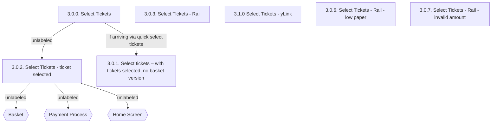

# Flow: Translink TVM — Choose Ticket Details

- Source: knowledge/flows/translink-tvm-full-transcription-v3.4.4.md (Overflow project "TVM",
  https://overflow.io/s/08CCGD4Q/, board 7 "Choose Ticket Details"). Transcribed/structured
  2026-08-05.
- Project: translink   Device: TVM   Feature: choose ticket details (ticket type selection prior to
  basket/payment)
- Transcription confidence: **medium** — the raw transcription's Connections/Flow list (5 entries)
  does not cover all 7 screens listed for this board; several screens (Rail, yLink, low-paper,
  invalid-amount variants) have no stated incoming/outgoing connection in the source. See
  Notes/unknowns.

## Diagram

## Paths (each path = one candidate scenario)
| # | Path | Feature | Tags | Covered by |
|---|------|---------|------|------------|
| 1 | Select Tickets (3.0.0) → ticket selected (3.0.2) | choose-ticket-details | — | 4103680, 4103681, 4103682, 4104847-4104864 (and other Ticket Issue cases) |
| 2 | Select Tickets (3.0.0) → arriving via quick select tickets → Select tickets, no basket version (3.0.1) | choose-ticket-details | — | 4105327 |
| 3 | Select Tickets - ticket selected (3.0.2) → Basket | choose-ticket-details | — | 4103704, 4103705, 4103706, 4103707, 4103708, 4103709, 4103710 |
| 4 | Select Tickets - ticket selected (3.0.2) → Payment Process | choose-ticket-details | — | 4103680, 4104847, 4104848 (and the cash/Chip&PIN/contactless variants across Ticket Issue, Advance & 3-Day, Rail & Cross-Border) |
| 5 | Select Tickets - ticket selected (3.0.2) → Home Screen | choose-ticket-details | — | 4105328 |
| 6 | Select Tickets - Rail (3.0.3) reached (screen exists; entry path not specified in source) | choose-ticket-details | @destructive | 4103696-4103703, 4104870-4104887 (Rail & Cross-Border (Kiosk) section) |
| 7 | Select Tickets - yLink (3.1.0) reached (screen exists; entry path not specified in source) | choose-ticket-details | — | 4105329 |
| 8 | Select Tickets - Rail - low paper (3.0.6) shown when not enough ticket paper to print requested amount | choose-ticket-details | @destructive | 4105330 |
| 9 | Select Tickets - Rail - invalid amount (3.0.7) shown when purchase would exceed the £500.00 machine limit (takes priority over the paper-level error) | choose-ticket-details | @destructive | 4105331 |

## Screen states (Given/Then anchors)
- **3.0.0. Select Tickets** — initial ticket-type selection screen. "Pay Now" and "Add to Basket"
  buttons are faded out/unavailable until the user has selected a number of tickets. For most ticket
  types, the TVM also offers an alternative ticket type shown on the right-hand side of the screen;
  if no alternative ticket is available on Cloudflare, that side of the screen is blank. Once one
  ticket type has been selected, the other type becomes unavailable.
- **3.0.2. Select tickets - ticket selected** — shows the ticket type selected by the user. If
  needed, a product description appears next to "Single". Leads onward to Basket, Payment Process,
  or Home Screen.
- **3.0.1. Select tickets – with tickets selected, no basket version** — the "Quick Select"
  variation of the ticket-selected state, reached specifically when arriving via the quick-select
  tickets path; has no basket step.
- **3.0.3. Select Tickets - Rail** — Rail variant of the select-tickets screen.
- **3.1.0 Select Tickets - yLink** — yLink variant of the select-tickets screen (see Smartcards
  board for the yLink flow itself).
- **3.0.6. Select Tickets - Rail - low paper** — error state shown when there is not enough ticket
  paper to print the amount of tickets requested; "Pay Now" and "Alternative Tickets" buttons are
  replaced by an error message.
- **3.0.7. Select Tickets - Rail - invalid amount** — error state shown when the purchase would
  exceed the machine's £500.00 purchase limit; this error takes priority over the paper-level error.
  "Add to Basket" is permanently faded out/unavailable on this screen.

## Notes / unknowns
- TODO: confirm the exact user action that triggers 3.0.0 → 3.0.2 (e.g. tapping a ticket
  type/quantity) — the source's Connections/Flow list gives the arrow but no bracketed trigger label
  for this one.
- TODO: confirm the triggers for 3.0.2 → Basket, 3.0.2 → Payment Process, and 3.0.2 → Home Screen —
  same gap, no bracketed action given in the source (contrast with the "[Confirm Selection]" labels
  used on these same target decisions elsewhere in the full transcription, e.g. from the Buy Tickets
  and Destination boards).
- TODO: confirm how/when 3.0.3 (Rail), 3.1.0 (yLink), 3.0.6 (low paper), and 3.0.7 (invalid amount)
  are reached — the board lists them as screens (7 total) but the Connections/Flow section only
  documents 5 connections, none of which name these four screens as a source or target. Likely
  reached as state variants of 3.0.0/3.0.2 under Rail/yLink product types or the paper-level/purchase
  -limit error conditions described in the annotations, but the source does not state the connecting
  arrow explicitly — do not assume the exact transition.
- "Error Messages" is listed as its own annotation heading (12 total annotations) grouping the
  low-paper and invalid-amount error notes; kept as narrative context above rather than a separate
  screen/decision, since the source does not give it a distinct node id.
- Home Screen, Basket, and Payment Process are decision points that hand off to their own boards
  (see `knowledge/flows/translink-tvm-full-transcription-v3.4.4.md` boards 4, 13, 11 respectively) —
  not further expanded here.
