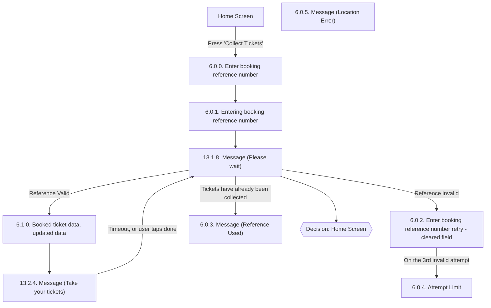

# Flow: Translink TVM — Collect Tickets by Reference

- Source: `knowledge/flows/translink-tvm-full-transcription-v3.4.4.md`, board "10. Collect Tickets by
  Reference" (Overflow.io project "TVM", https://overflow.io/s/08CCGD4Q/). Transcribed verbatim via
  the Claude Chrome extension. Structured into this flow map 2026-08-05.
- Project: translink   Device: TVM   Feature: collect tickets by booking reference
- Transcription confidence: **high** — verbatim, not summarized. Two gaps flagged below where the
  source board's own connection list is incomplete (see Notes/unknowns).

## Diagram

> `LOCERR` (6.0.5. Message - Location Error) is drawn detached — the source board lists it as a
> screen and gives its annotation text ("An error for if tickets can only be picked up in certain
> locations") but the Connections/Flow list has no entry naming it as a source or target. See
> Notes/unknowns.

## Paths (each path = one candidate scenario)
| # | Path | Feature | Tags | Covered by |
|---|------|---------|------|------------|
| 1 | Home Screen → Press 'Collect Tickets' → Enter booking reference number → Entering booking reference number → Please wait → **Reference Valid** → Booked ticket data, updated data → Take your tickets → (timeout or user taps done) → Please wait → Home Screen | collect-tickets-by-reference | @bos | C4103620, C4104806, C4104807, C4104808, C4104809, C4104810, C4103729, C4103677 |
| 2 | Please wait → **Reference invalid** → Enter booking reference number retry - cleared field | collect-tickets-by-reference | @destructive | C4103625, C4104812, C4104813, C4104814 |
| 3 | Enter booking reference number retry - cleared field → **3rd invalid attempt** → Attempt Limit | collect-tickets-by-reference | @destructive | 4105332 |
| 4 | Please wait → **Tickets have already been collected** → Message (Reference Used) | collect-tickets-by-reference | @destructive | C4103632 |
| 5 | Please wait → (unlabelled transition) → Decision: Home Screen | collect-tickets-by-reference | — | 4105333 |
| 6 | Enter booking reference number → Back → Enter booking reference number (per annotation "Back takes you to 6.0.0") | collect-tickets-by-reference | — | 4105334 |
| 7 | Any collect-tickets screen → timeout → Home Screen (per repeated "Timeout to Home Screen" annotation) | collect-tickets-by-reference | @destructive | C4103630 |
| 8 | (unconfirmed) Enter booking reference number → booking reference for a location-restricted ticket → Message (Location Error) | collect-tickets-by-reference | @destructive | 4105335 |

## Screen states (Given/Then anchors)
- **6.0.0. Enter booking reference number** — entry screen for this flow, reached from Home Screen
  (and Multi Modal Home Screen, per boards 3/4) via 'Collect Tickets'. Annotation: "Back takes you to
  6.0.0" is recorded against this area of the flow (exact originating screen for that Back action is
  ambiguous — see Notes/unknowns). Synthesized speech "Speech 12 – Please enter your booking
  reference number" plays here or on 6.0.1 (duplicated in the annotation list; not attributable to one
  screen only).
- **6.0.1. Entering booking reference number** — active entry state; 'Confirm' button stays
  unavailable until the first letter/number is pressed.
- **13.1.8. Message (Please wait)** — interstitial shown after submitting the reference; branches
  three ways (Reference Valid / Reference invalid / Tickets have already been collected) plus an
  unlabelled transition to the Home Screen decision point. Also the screen returned to after "Take
  your tickets" times out or the user taps done.
- **6.1.0. Booked ticket data, updated data** — shows booking data; fields shown are dependent on the
  ticket type being collected — e.g. 'Date of Use' is an optional field, only shown when relevant to
  the tickets collected.
- **6.0.2. Enter booking reference number retry - cleared field** — retry state after an invalid
  reference; field is cleared. Escalates to Attempt Limit on the 3rd invalid attempt.
- **6.0.3. Message (Reference Used)** — shown when the submitted reference's tickets have already
  been collected.
- **6.0.5. Message (Location Error)** — error shown for tickets that can only be picked up in certain
  locations (per its annotation). No connection into or out of this screen is recorded in the source
  board — see Notes/unknowns.
- **13.2.4. Message (Take your tickets)** — "Speech 11 – Please take your tickets" is played; times
  out (or user taps done) back to the Please wait screen.
- **6.0.4. Attempt Limit** — reached after the 3rd consecutive invalid reference-number attempt from
  the retry screen. No outgoing connection is recorded in the source board — see Notes/unknowns.

## Notes / unknowns
- TODO: confirm which screen(s) the two duplicated "Timeout to Home Screen" annotations attach to —
  the source board lists them twice in its annotation set but the Connections/Flow list only shows
  one explicit (unlabelled) transition from "13.1.8. Message (Please wait)" to the "Home Screen"
  decision point. Do not assume every screen times out; only the connection actually drawn is
  asserted as Path 5, and the general "any screen times out" behaviour (Path 7) is flagged
  @destructive/unconfirmed pending this check.
- TODO: confirm the outgoing connection(s) from "6.0.4. Attempt Limit" — the source board records it
  as a screen and as the destination of the 3rd-invalid-attempt transition, but no further connection
  out of it is listed (e.g. does it route to Home Screen, or offer another retry?).
- TODO: confirm how/whether "6.0.5. Message (Location Error)" is entered and exited — it is listed
  among this board's 10 screens with a standalone annotation describing its purpose, but is absent
  from every entry in the Connections/Flow list. Path 8 above is marked unconfirmed for this reason.
- TODO: confirm the exact screen "Back takes you to 6.0.0" is attached to — the source lists this
  annotation within the board's flat annotation list without an explicit screen association; the most
  likely candidate is "6.0.1. Entering booking reference number" but this is not stated verbatim.
- This board is reached from both "4. Home Screen" and "3. Multi Modal Home Screen" via a "Press
  'Collect Tickets'" action (per those boards' own Connections/Flow lists), and both hand off into
  "12. Ticket Printing" after "Identify and confirm tickets" — those cross-board connections belong to
  the Home Screen / Ticket Printing flow-maps, not this one, and are only referenced here for
  context.
- Single-board feature area; not split — the board contains one cohesive reference-collection flow
  with no genuinely distinct sub-areas (unlike ETM's FLU/Driver Menu boards).
