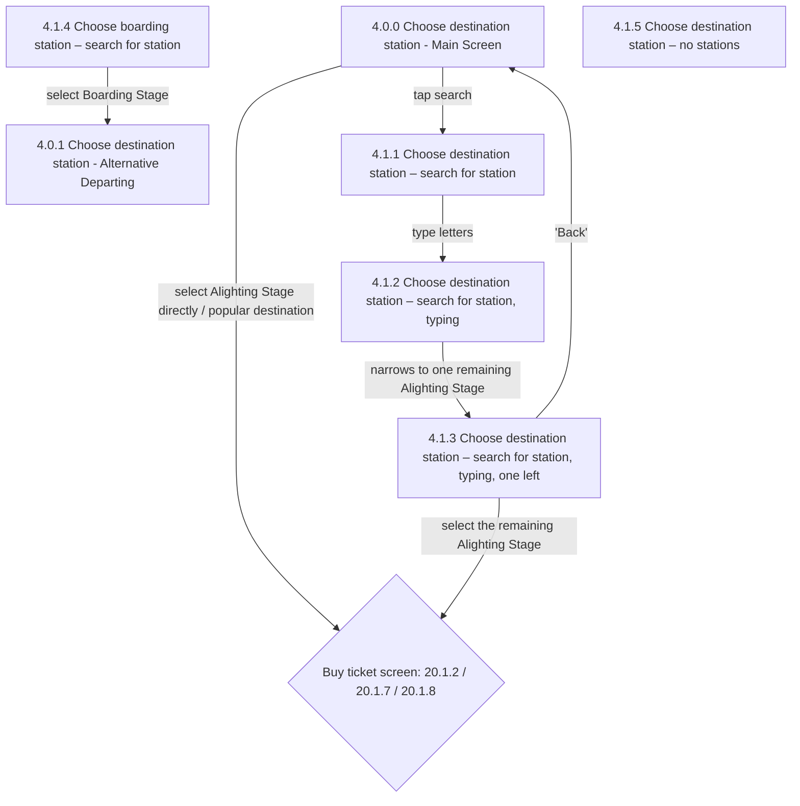

# Flow: Translink TVM — Destination and Boarding Selection

- Source: `knowledge/flows/translink-tvm-full-transcription-v3.4.4.md`, board "6. Destination and
  Boarding Selection". Transcribed/structured 2026-08-05.
- Project: translink   Device: TVM   Feature: destination and boarding (alighting/departing stage
  search and selection)
- Transcription confidence: **high** for Screens/Annotations/Connections as listed in the source;
  **medium** for how the Boarding-Stage-change sub-flow (4.1.4/4.0.1) and the "no stations" screen
  (4.1.5) actually wire in, since the source's own Connections/Flow list does not give explicit edges
  for them — see Notes/unknowns.

## Diagram

## Paths (each path = one candidate scenario)
| # | Path | Feature | Tags | Covered by |
|---|------|---------|------|------------|
| 1 | Main Screen → select Alighting Stage directly (popular destination) → Buy ticket screen | destination-boarding | — | 4105336 |
| 2 | Main Screen → search for station → type letters (keyboard greys out unavailable letters) → select Alighting Stage → Buy ticket screen | destination-boarding | — | 4105337 |
| 3 | Search → type letters until only one Alighting Stage remains → select it → Buy ticket screen | destination-boarding | — | 4105338 |
| 4 | Search, typing → 'Back' → returns to Main Screen, keyboard closes and typed letters clear | destination-boarding | — | 4105339 |
| 5 | Search → scroll buttons used to page through remaining Alighting Stage options (while 6+ remain) | destination-boarding | — | 4105340 |
| 6 | Scrolling: once fewer than 6 possible Alighting Stages remain, scroll buttons disappear | destination-boarding | — | 4105341 |
| 7 | Change Boarding Stage via 'Departing From' → search/select new Boarding Stage → Alternative Departing screen, now selecting destination against the new Boarding Stage | destination-boarding | — | 4105342 |
| 8 | 'Back' after changing Boarding Stage → returns to Main Screen but the changed Boarding Stage is NOT undone by 'Back' | destination-boarding | @destructive | 4105343 |
| 9 | Select a Boarding Stage that has no possible Alighting Stages → all keyboard buttons grey out (unusable) | destination-boarding | @destructive | 4105344 |

## Screen states (Given/Then anchors)
- **4.0.0. Choose destination station - Main Screen** — Boarding Stage defaults to the TVM's own
  location; plays synthesized speech "Speech 10 – Choose from popular destinations or search for
  another destination". Offers both popular-destination buttons and a 'Departing From' button (to
  change Boarding Stage) and a search entry point.
- **4.1.1. Choose destination station – search for station** — entry point into the on-screen
  keyboard search for an Alighting Stage.
- **4.1.2. Choose destination station – search for station, typing** — as the user types, keys that
  cannot continue a valid station name grey out; keys that can continue one brighten. Alighting Stage
  option list narrows to names starting with the typed letters.
- **4.1.3. Choose destination station – search for station, typing, one left** — only one possible
  Alighting Stage remains; only the letters that can still follow the typed prefix are lit, along with
  Delete and Clear. 'Back' closes the keyboard and clears typed letters, but does NOT undo a Boarding
  Stage change made earlier in the flow.
- **4.1.4. Choose boarding station – search for station** — search/select flow for a new Boarding
  Stage; annotated as using "the same process as the process for selecting an Alighting Stage."
- **4.0.1. Choose destination station - Alternative Departing** — Main Screen equivalent once the
  Boarding Stage has been changed away from the TVM's default location (example given: Boarding Stage
  set to 'Rosepark'); user now selects destination against that new Boarding Stage.
- **4.1.5. Choose destination station – no stations** — reached when the selected Boarding Stage has
  no possible Alighting Stages; all keyboard buttons grey out as unusable.
- **Buy ticket screen (decision: 20.1.2 / 20.1.7 / 20.1.8)** — routes to one of the mode-specific "Buy
  Tickets" screens (see `translink-tvm-full-transcription-v3.4.4.md` board 5); this board's source
  does not state the selection criteria between the three.

## Notes / unknowns
- TODO: confirm the explicit trigger/edge from Main Screen (4.0.0) or Alternative Departing (4.0.1)
  into Boarding-stage search (4.1.4) — the annotation describes tapping 'Departing From', but the
  source's own Connections/Flow list for this board has no edge into 4.1.4; only 4.1.4 → 4.0.1 is
  listed.
- TODO: confirm whether Alternative Departing (4.0.1) has its own edge to the Buy ticket decision
  mirroring 4.0.0's — an annotation implies the user can now pick a destination against the new
  Boarding Stage ("Now the user can select destination, with the Boarding Stage set as 'Rosepark'"),
  but no such connection is listed explicitly in Connections/Flow for this board.
- TODO: confirm the edge(s) into "4.1.5. Choose destination station – no stations" — this screen is
  listed under Screens and referenced by an annotation (Boarding Stage with no possible Alighting
  Stages), but has no explicit Connections/Flow entry in the source.
- Decision point label is transcribed verbatim from the source as "Buy ticket screen: 20.1.2 ; 20.1.7
  20.1.8" (punctuation/line-break as given); which of the three is shown is resolved by ticket-type/
  mode logic covered elsewhere (board 5, "Buy Tickets"), not by this board.
