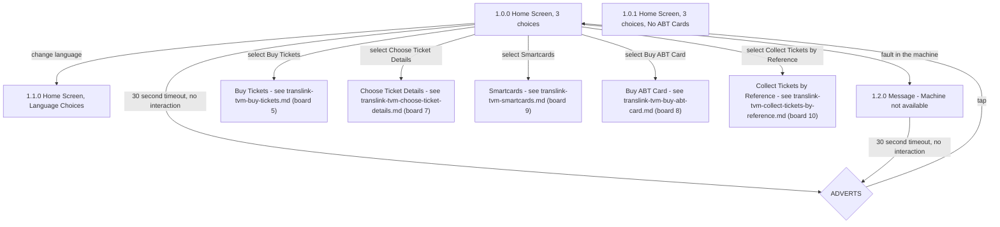

# Flow: Translink TVM — Home Screen

- Source: `knowledge/flows/translink-tvm-full-transcription-v3.4.4.md`, board "4. Home Screen"
  (Overflow project "TVM", https://overflow.io/s/08CCGD4Q/). Transcribed/structured 2026-08-05.
- Project: translink   Device: TVM   Feature: home screen (entry point, language, machine-unavailable, idle adverts)
- Transcription confidence: **high** — verbatim from the full transcription, not summarized.

## Diagram

## Paths (each path = one candidate scenario)
| # | Path | Feature | Tags | Covered by |
|---|------|---------|------|------------|
| 1 | Home Screen → select Buy Tickets → (Buy Tickets board) | home | — | FRAGMENTED — see consolidation-audit.md |
| 2 | Home Screen → select Choose Ticket Details → (Choose Ticket Details board) | home | — | 4105345 |
| 3 | Home Screen → select Smartcards → (Smartcards board) | home | — | 4105346 |
| 4 | Home Screen → select Buy ABT Card → (Buy ABT Card board) | home | — | 4105347 |
| 5 | Home Screen → select Collect Tickets by Reference → (Collect Tickets by Reference board) | home | — | C4103677 (Smoke), C4103729, C4103730, C4103731, C4103732 (Functional/Sales - Tickets/Ticket Collection) |
| 6 | Home Screen → change language → Home Screen, Language Choices | home | — | C4103690 |
| 7 | Home Screen → fault in machine → Message (Machine not available) → 30s timeout → Adverts | home | @destructive | 4105348 |
| 8 | Home Screen → no interaction 30s → Adverts → tap → Home Screen | home | — | C4103674, C4103798 |
| 9 | Message (Machine not available) → 30s timeout → Adverts → tap → Home Screen | home | — | 4105349 |

> `Covered by` stays `?` — a later `/audit-flows` pass fills this in against the live TestRail suite.

## Screen states (Given/Then anchors)
- **1.0.0 Home Screen, 3 choices** — the main entry point; offers Buy Tickets, Choose Ticket Details,
  Smartcards, Buy ABT Card, and Collect Tickets by Reference as decision-point destinations into other
  boards, plus a language-change control.
- **1.0.1 Home Screen, 3 choices, No ABT Cards** — per its own annotation: "Home screen with 'Buy ABT
  Card' button disabled." TODO: confirm — this screen is listed under Screens (4) for this board but
  does not appear in the transcription's Connections/Flow (9) list, so the trigger/condition that
  shows this variant instead of 1.0.0 is not stated in the source.
- **1.1.0 Home Screen, Language Choices** — reached from Home Screen by changing language. Per the
  Welcome Page's annotation, English is default; per this board's own annotation, if the user changes
  language then later presses Cancel, finishes a transaction, or times out, the TVM returns to the
  Home Screen in English (i.e. the language choice does not persist past that point).
- **1.2.0 Message (Machine not available)** — shown when there is a fault in the machine (per its
  connection annotation); after a 30 second timeout with no interaction it also routes to Adverts.
- **ADVERTS** — the idle/advertising decision point; reached via a 30 second timeout from either Home
  Screen or the Machine-not-available message; tapping it returns to the Home Screen. Transcribed as a
  "Decision Point" in the source rather than a numbered screen, so no screen ID is given for it.

## Notes / unknowns
- The five destinations from Home Screen (Buy Tickets, Choose Ticket Details, Smartcards, Buy ABT
  Card, Collect Tickets by Reference) are transcribed in this board only as "Decision Point" nodes —
  Overflow's link-out node type — not as expanded screens. Their own screen-by-screen detail belongs to
  their own boards in the full transcription (boards 5, 7, 9, 8, 10 respectively) and to those boards'
  own flow-map files, not this one.
- TODO: confirm the condition that surfaces "1.0.1 Home Screen, 3 choices, No ABT Cards" instead of
  "1.0.0 Home Screen, 3 choices" — likely a config/region setting that disables ABT cards, per its
  annotation, but no connection/trigger for it is present in the source transcription for this board.
- TODO: confirm whether "ADVERTS" cycles through multiple advert screens/timeout loops, or is a single
  screen — the source only labels it a Decision Point with a "30 Second Timeout, return on tap"
  annotation and gives no further screen breakdown in this board.
- This board did not bundle multiple genuinely distinct feature areas (unlike ETM's FLU/Driver Menu
  boards) — kept as a single file.
