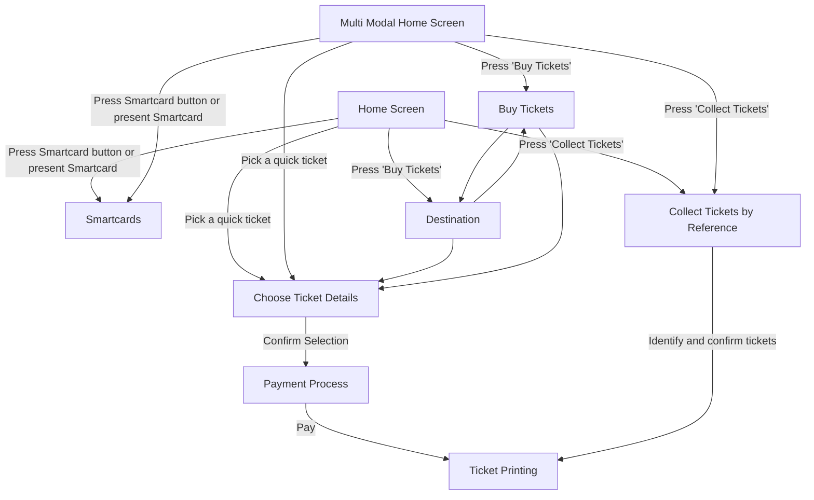

# Flow: Translink TVM — Map (overview / board index)

- Source: `knowledge/flows/translink-tvm-full-transcription-v3.4.4.md`, board "2. Map"
  (Overflow project "TVM", https://overflow.io/s/08CCGD4Q/). Transcription/structuring date:
  2026-08-05.
- Project: translink   Device: TVM   Feature: overview map (top-level board-to-board navigation)
- Transcription confidence: **high** — verbatim from the transcription file, not summarized.
- **Board note**: this board is Overflow's own navigational overview linking to the other 13 TVM
  boards ("refer back to this map if you become unsure which board to view next" — per its own
  annotation). Its "Decision Points" are not user-facing decision dialogs; they are node references
  to the other boards (Multi Modal Home Screen, Home Screen, Choose Ticket Details, Smartcards, Buy
  Tickets, Collect Tickets by Reference, Destination, Payment Process, Ticket Printing). Rendered
  below as plain nodes, not `{}` decision shapes, to avoid implying an in-board decision that isn't
  there. This single board does not bundle multiple distinct feature areas, so it is kept as one
  file (unlike the ETM FLU/Driver Menu boards, which were split).

## Diagram

> Note on the diagram: the source lists 22 connection lines but several are exact duplicates of the
> same edge (e.g. "Payment Process → Ticket Printing [Pay]" appears 4×, "Choose Ticket Details →
> Payment Process [Confirm Selection]" appears 4×, "Collect Tickets by Reference → Ticket Printing
> [Identify and confirm tickets]" appears 2×) — collapsed to 15 unique edges above, all present
> verbatim in the source, none invented.

## Paths (each path = one candidate scenario)
| # | Path | Feature | Tags | Covered by |
|---|------|---------|------|------------|
| 1 | Home Screen → Collect Tickets by Reference → identify and confirm tickets → Ticket Printing | tvm-map | — | C4103677, C4103729-C4103732, C4103620-C4103632, C4104806-C4104811, C4104818-C4104819 (Ticket Collection section); Smoke case 'Ticket Collection - a pre-paid ticket is collected and printed' |
| 2 | Home Screen → Smartcards (press Smartcard button or present Smartcard) | tvm-map | — | 4105350 |
| 3 | Home Screen → pick a quick ticket → Choose Ticket Details → Confirm Selection → Payment Process → Pay → Ticket Printing | tvm-map | — | C4103685, C4104857, C4104858 (Ticket Issue - Popular tickets shortcut, cash/card/contactless) |
| 4 | Home Screen → press 'Buy Tickets' → Destination → Buy Tickets → Choose Ticket Details → Confirm Selection → Payment Process → Pay → Ticket Printing | tvm-map | — | Functional/Sales-Tickets/Ticket Issue (Adult/Child single, Family & Friends, Evening, Day, Summer Bus Rambler, concessionary half-fare, Day Return, 1 Month Return -- cash/card/contactless variants); Functional/Sales-Tickets/Grouped Stops (7 cases); Functional/Sales-Tickets/Basket (amending boarding/alighting stage cases); C4103758/C4103759 (Configuration Topology - home location / destination-outside-triangle) |
| 5 | Home Screen → press 'Buy Tickets' → Destination → Choose Ticket Details (direct) → Confirm Selection → Payment Process → Pay → Ticket Printing | tvm-map | — | Functional/Sales-Tickets/Ticket Issue (Adult/Child single, Family & Friends, Evening, Day, Summer Bus Rambler, concessionary half-fare, Day Return, 1 Month Return -- cash/card/contactless variants); Functional/Sales-Tickets/Grouped Stops (7 cases); Functional/Sales-Tickets/Basket (amending boarding/alighting stage cases); C4103758/C4103759 (Configuration Topology - home location / destination-outside-triangle) |
| 6 | Multi Modal Home Screen → Collect Tickets by Reference → identify and confirm tickets → Ticket Printing | tvm-map | — | 4105352 |
| 7 | Multi Modal Home Screen → Smartcards (press Smartcard button or present Smartcard) | tvm-map | — | 4105351 |
| 8 | Multi Modal Home Screen → pick a quick ticket → Choose Ticket Details → Confirm Selection → Payment Process → Pay → Ticket Printing | tvm-map | — | C4103685, C4104857, C4104858 (Ticket Issue - Popular tickets shortcut, cash/card/contactless) |
| 9 | Multi Modal Home Screen → press 'Buy Tickets' → Buy Tickets → Destination → Choose Ticket Details → Confirm Selection → Payment Process → Pay → Ticket Printing | tvm-map | — | Functional/Sales-Tickets/Ticket Issue (Adult/Child single, Family & Friends, Evening, Day, Summer Bus Rambler, concessionary half-fare, Day Return, 1 Month Return -- cash/card/contactless variants); Functional/Sales-Tickets/Grouped Stops (7 cases); Functional/Sales-Tickets/Basket (amending boarding/alighting stage cases); C4103758/C4103759 (Configuration Topology - home location / destination-outside-triangle) |
| 10 | Multi Modal Home Screen → press 'Buy Tickets' → Buy Tickets → Choose Ticket Details (direct) → Confirm Selection → Payment Process → Pay → Ticket Printing | tvm-map | — | Functional/Sales-Tickets/Ticket Issue (Adult/Child single, Family & Friends, Evening, Day, Summer Bus Rambler, concessionary half-fare, Day Return, 1 Month Return -- cash/card/contactless variants); Functional/Sales-Tickets/Grouped Stops (7 cases); Functional/Sales-Tickets/Basket (amending boarding/alighting stage cases); C4103758/C4103759 (Configuration Topology - home location / destination-outside-triangle) |
| 11 | Destination ↔ Buy Tickets — both boards link to each other directly (Destination → Buy Tickets, Buy Tickets → Destination) as well as each linking straight to Choose Ticket Details | tvm-map | — | 4105353 |

## Screen states (Given/Then anchors)
- **This board has no Screens (0) and no genuine Decision Points (0)** per the transcription — every
  node referenced here is a link to another top-level board, not a screen or decision rendered on
  this board itself. Screen-level detail for each of these lives in that board's own flow-map (e.g.
  Home Screen, Choose Ticket Details, Payment Process, Ticket Printing, Smartcards, etc.).
- **Two entry points into the buy/collect/smartcard flows**: "Home Screen" and "Multi Modal Home
  Screen" — both link to the same four downstream areas (Collect Tickets by Reference, Smartcards,
  Choose Ticket Details, and the Destination/Buy Tickets pair), with identical trigger labels.
- **Destination and Buy Tickets are mutually linked** — each links to the other and each links
  directly onward to Choose Ticket Details, rather than a single fixed order.
- **Payment Process and Ticket Printing are the shared convergence points** — Choose Ticket Details
  always routes to Payment Process ("Confirm Selection"), and Payment Process always routes to
  Ticket Printing ("Pay"); Collect Tickets by Reference routes straight to Ticket Printing
  ("Identify and confirm tickets") without going through Payment Process on this map.

## Notes / unknowns
- TODO: confirm how "Smartcards" connects onward to Payment Process / Ticket Printing. This board's
  own annotations state twice ("Payment and Printing included in smartcard flow") that payment and
  printing are part of the Smartcards flow, but no explicit connection edge from Smartcards to
  Payment Process or Ticket Printing is present on this Map board itself — that routing is presumably
  drawn inside the "9. Smartcards" board, not here. Not invented; left as a gap on this overview.
- This file transcribes only the "Map" overview board. The 13 other boards it links to (Welcome
  Page, Multi Modal Home Screen, Home Screen, Buy Tickets, Destination and Boarding Selection,
  Choose Ticket Details, Buy ABT Card, Smartcards, Collect Tickets by Reference, Payment Process,
  Ticket Printing, Basket, Timeouts) are separate transcription/structuring passes, not covered by
  this file.
