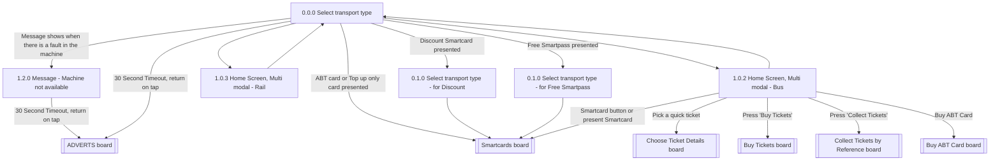

# Flow: Translink TVM — Multi Modal Home Screen

- Source: `knowledge/flows/translink-tvm-full-transcription-v3.4.4.md`, board "3. Multi Modal Home
  Screen" (Overflow.io project "TVM", https://overflow.io/s/08CCGD4Q/). Transcribed/structured
  2026-08-05.
- Project: translink   Device: TVM   Feature: multi-modal home screen (transport-type selection,
  Bus/Rail home, smartcard-triggered transport selection)
- Transcription confidence: **high** for the screens/connections explicitly listed on this board;
  **medium** for Rail's downstream options — the source board only lists outgoing decision
  connections from the Bus home screen, not Rail (see Notes).

## Diagram

## Paths (each path = one candidate scenario)
| # | Path | Feature | Tags | Covered by |
|---|------|---------|------|------------|
| 1 | Select transport type → fault in machine → Message (Machine not available) → 30s timeout → ADVERTS | multi-modal-home | @destructive | 4105354 |
| 2 | Select transport type → 30s timeout (no fault) → ADVERTS | multi-modal-home | — | 4105355 |
| 3 | Select transport type → ABT card or Top-up only card presented → Smartcards | multi-modal-home | — | 4105356 |
| 4 | Select transport type → choose Bus → Home Screen, Multi modal - Bus → back → Select transport type | multi-modal-home | — | C4103796 |
| 5 | Select transport type → choose Rail → Home Screen, Multi modal - Rail → back → Select transport type | multi-modal-home | — | C4104907 |
| 6 | Select transport type → Discount Smartcard presented → Select transport type for Discount → Smartcards | multi-modal-home | — | 4105357 |
| 7 | Select transport type → Free Smartpass presented → Select transport type for Free Smartpass → Smartcards | multi-modal-home | — | 4105358 |
| 8 | Home Screen, Multi modal - Bus → pick a quick ticket → Choose Ticket Details | multi-modal-home | — | 4105361 |
| 9 | Home Screen, Multi modal - Bus → Press 'Buy Tickets' → Buy Tickets | multi-modal-home | — | 4105362 |
| 10 | Home Screen, Multi modal - Bus → Press 'Collect Tickets' → Collect Tickets by Reference | multi-modal-home | — | 4105363 |
| 11 | Home Screen, Multi modal - Bus → Buy ABT Card → Buy ABT Card board | multi-modal-home | — | 4105359 |
| 12 | Home Screen, Multi modal - Bus → Smartcard button pressed or Smartcard presented → Smartcards | multi-modal-home | — | 4105360 |

## Screen states (Given/Then anchors)
- **0.0.0 Select transport type** — entry screen for the Multi Modal home flow; shown only in the
  Multi Modal solution (not the single-mode Home Screen board). Offers Bus/Rail transport-type
  selection and is the return target from either mode's home screen.
- **1.2.0. Message (Machine not available)** — shown when there is a fault in the machine; routes
  to ADVERTS after a 30-second timeout or a tap.
- **1.0.2. Home Screen, Multi modal - Bus** — shown after choosing Bus; offers quick-ticket
  selection (Choose Ticket Details), Buy Tickets, Collect Tickets by Reference, Buy ABT Card, and
  Smartcards.
- **1.0.3. Home Screen, Multi modal - Rail** — shown after choosing Rail. Only outgoing connection
  captured on this board is back to "Select transport type" — see Notes.
- **0.1.0 Select transport type for Discount** — shown when a Discounted Smartcard is presented;
  per annotation, user must choose which transport type to buy a ticket for. Routes to Smartcards.
- **0.1.0 Select transport type for Free Smartpass** — shown when a Free Smartpass card is
  presented; per annotation, user must choose which transport type to buy a ticket for. Routes to
  Smartcards.
- **ADVERTS / Smartcards / Choose Ticket Details / Buy Tickets / Collect Tickets by Reference /
  Buy ABT Card** — not screens on this board; each is a decision point that hands off to a
  separate Overflow board of the same name (see the Board Index in
  `translink-tvm-full-transcription-v3.4.4.md`: boards 5, 7, 8, 9, 10, and the ADVERTS reference
  in board 2 "Map").

## Notes / unknowns
- TODO: confirm whether Rail's home screen ("1.0.3. Home Screen, Multi modal - Rail") offers the
  same downstream options as Bus (Choose Ticket Details, Buy Tickets, Collect Tickets by
  Reference, Buy ABT Card, Smartcards). This board's Connections / Flow list only enumerates those
  five outgoing decisions from the **Bus** home screen — Rail's only captured connection is back to
  "Select transport type." Not asserting Rail has fewer options; just not evidenced in the source.
- TODO: confirm the "24+ card" routing. The board's annotations state: "If 24+ card is presented
  then flow immediately advances to the (3.1.3 Select Tickets - 24 Rail) 24+ ticket type selection
  screen" — but that screen is not listed in this board's own Screens or Connections lists, so the
  trigger point (does it fire from "0.0.0 Select transport type" like the Discount/Free Smartpass
  cases?) is not shown here. Likely detailed on a downstream board (Choose Ticket Details /
  Smartcards) — not transcribed as part of this file since it's outside this board's own
  Connections list.
- The six decision-point hand-offs (ADVERTS, Smartcards, Choose Ticket Details, Buy Tickets,
  Collect Tickets by Reference, Buy ABT Card) are cross-board references, not screens local to
  this flow — kept as subroutine nodes in the diagram rather than invented screen detail.
