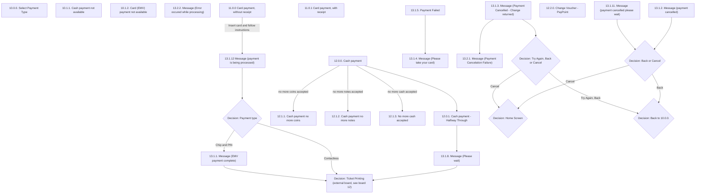

# Flow: Translink TVM — Payment Process

- Source: `knowledge/flows/translink-tvm-full-transcription-v3.4.4.md`, board "11. Payment Process"
  (Overflow project "TVM", https://overflow.io/s/08CCGD4Q/). Transcribed/structured 2026-08-05.
- Project: translink   Device: TVM   Feature: payment process (cash / card payment, cancellation, timeouts)
- Transcription confidence: **high** — verbatim from the raw transcription, not summarized.

## Diagram

> **TODO: confirm** — the raw transcription's "Connections / Flow" list for this board does not
> include arrows into/out of `SELECT` (10.0.0. Select Payment Type), `CASHUNAVAIL` (10.1.1),
> `CARDUNAVAIL` (10.1.2), `ERRPROC` (13.2.2), `CARDRECEIPT` (11.0.1), or `VOUCHER` (12.2.0), even
> though all six are listed among this board's 21 screens. They are drawn above as unconnected
> nodes rather than guessed into the flow — see Notes/unknowns.

## Paths (each path = one candidate scenario)
| # | Path | Feature | Tags | Covered by |
|---|------|---------|------|------------|
| 1 | Card payment (no receipt) → Insert card, follow instructions → payment being processed → Payment type = Contactless → Ticket Printing | payment | — | 4103661, 4104568, 4104569, 4104570, 4104571, 4103663, 4104575, 4104576 |
| 2 | Card payment (no receipt) → payment being processed → Payment type = Chip and PIN → EMV payment complete → Ticket Printing | payment | — | 4103657, 4103659, 4104561, 4104562, 4104563, 4104564, 4104566, 4104567 |
| 3 | Cash payment → Cash payment - Halfway Through → Please wait → Ticket Printing | payment | — | 4103643 (matches); 4103636 (does NOT match) |
| 4 | Cash payment → no more coins accepted | payment | @destructive | 4103646 |
| 5 | Cash payment → no more notes accepted | payment | @destructive | 4103647 |
| 6 | Cash payment → no more cash accepted | payment | @destructive | 4105364 |
| 7 | Payment cancelled message → Back or Cancel → Cancel → Home Screen | payment | @destructive | 4103645 |
| 8 | Payment cancelled message → Back or Cancel → Back → Back to 10.0.0. Select Payment Type | payment | @destructive | 4105365 |
| 9 | Payment cancelled please wait → Back or Cancel → Cancel → Home Screen | payment | @destructive | 4105366 |
| 10 | Payment cancelled please wait → Back or Cancel → Back → Back to 10.0.0. Select Payment Type | payment | @destructive | 4105367 |
| 11 | Payment Cancelled - Change returned → Try Again, Back or Cancel → Try Again/Back → Back to 10.0.0. Select Payment Type | payment | @destructive | 4105368 |
| 12 | Payment Cancelled - Change returned → Try Again, Back or Cancel → Cancel → Home Screen | payment | @destructive | 4105369 |
| 13 | Payment Cancelled - Change returned → Payment Cancelation Failure (change fails to return) | payment | @destructive | 4105370 |
| 14 | Payment Failed → Please take your card | payment | @destructive | 4105371 |

## Screen states (Given/Then anchors)
- **10.0.0. Select Payment Type** — entry screen for this board; plays "Speech 3 – Please select
  Payment type". No outbound/inbound connection captured in the raw transcription (see TODO above).
- **10.1.1. Cash payment not available** / **10.1.2. Card (EMV) payment not available** — per
  annotation, plays "Speech 4 – Credit or Debit payments only" / "Speech 5 – Cash payments only"
  respectively when the other tender type is unavailable.
- **13.2.2. Message (Error occured while processing)** — annotated as "the catch all error screen,
  it should never show. If it does, something has gone wrong that really wasn't supposed to. e.g.
  cash or card payment have become unavailable during the payment process."
- **11.0.0 Card payment, without receipt** — plays "Speech 8 – Present or insert your credit or
  debit card to pay". Leads to "payment is being processed" on "Insert card and follow instructions".
- **11.0.1 Card payment, with receipt** — per annotation, "User taps 'Receipt?' if they would like a
  receipt, the button goes green to signify that a receipt will be printed. The user can tap the
  button again if they decide they don't need a receipt."
- **12.0.0. Cash payment** — plays "Speech 6 – Insert coins or notes to pay". Branches to Halfway
  Through, no-more-coins, no-more-notes, and no-more-cash-accepted screens.
- **12.0.1. Cash payment - Halfway Through** — per annotation, "If the customer inserts coins or
  notes for a ticket of less value (e.g. £5 note for a £3 ticket), then the TVM will automatically
  calculate and issue change to the customer if there is sufficient change available in the change
  hoppers." Leads to "Message (Please wait)".
- **12.2.0. Change Voucher - PayPoint** — per annotation, shown "only when there is insufficient
  change in the change hoppers" (following on from Cash payment - Halfway Through). No explicit
  connection arrow captured (see TODO above).
- **13.1.12 Message (payment is being processed)** — leads into the "Payment type" decision
  (Contactless / Chip and PIN).
- **13.1.2. Message (payment cancelled)** / **13.1.11. Message (payment cancelled please wait)** —
  both play "Speech 7 – Payment Cancelled"; both feed into the "Back or Cancel" decision.
- **13.1.1. Message (EMV payment complete)** — reached via Payment type = Chip and PIN; leads to
  Ticket Printing.
- **13.1.3. Message (Payment Cancelled - Change returned)** — plays "Speech 7 – Payment Cancelled";
  leads to "Try Again, Back or Cancel" decision, or to Payment Cancelation Failure if change fails
  to return.
- **13.1.4. Message (Please take your card)** — per annotation, "shows (after 'Try Again' or
  'Cancel' selected) if the payment card needs removing." Plays "Speech 9 – Please take your debit
  or credit card".
- **13.1.5. Payment Failed** — per annotation, "also shows if the user presses cancel on the PIN pad
  or removes their card without completing the transaction." Leads to "Please take your card".
- **13.2.1. Message (Payment Cancelation Failure)** — reached from Change Returned when the change
  return itself fails.
- **Cancellations (board-level rule)** — per annotation: "After a payment type has been selected,
  the user pressing 'Cancel' won't take the user immediately to the home screen. Instead, a message
  will appear for a short time before the TVM returns to the home screen. The message displays
  information relevant to the payment stage the user is on e.g. reminding the user to collect their
  returned cash or to take their bank card."

## Notes / unknowns
- **Decision-point duplicates collapsed**: the raw transcription's "Decision Points (9)" list for
  this board contains two entries each for "Home Screen", "Ticket Printing", and "Back to 10.0.0."
  — these are the same decision node reached from two different upstream branches, not distinct
  nodes; collapsed to one node each in the diagram above.
- **Ticket Printing** is an external board (see the sibling board "12. Ticket Printing" in the raw
  transcription) — not expanded here; this file stops at the hand-off point.
- TODO: confirm how "10.0.0. Select Payment Type" connects onward to "12.0.0. Cash payment" /
  "11.0.0 Card payment, without receipt" / the "Payment type" decision — no arrow for this is
  present in the board's own "Connections / Flow" list, only in other boards' references to
  "Payment Process" as a black-box decision.
- TODO: confirm the trigger/placement of "10.1.1. Cash payment not available" and "10.1.2. Card
  (EMV) payment not available" in the flow — annotated (elsewhere in the raw file) as screens shown
  "if the user presses 'cancel'/'back' before the point where they have inserted cash (right) or
  their payment card (left)," but no explicit connection arrow into/out of either is captured on
  this board.
- TODO: confirm what triggers "13.2.2. Message (Error occured while processing)" — annotated as a
  catch-all that "should never show"; no connection arrow captured.
- TODO: confirm the connection into "11.0.1 Card payment, with receipt" (the receipt-toggle variant
  of card payment) and into "12.2.0. Change Voucher - PayPoint" — both are listed screens with
  annotations describing their behaviour, but neither has an explicit arrow in this board's
  "Connections / Flow" list.
