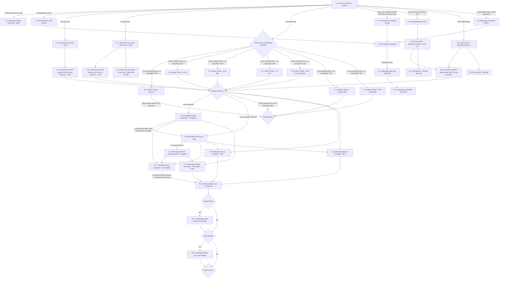

# Flow: Translink TVM — Smartcards

- Source: `knowledge/flows/translink-tvm-full-transcription-v3.4.4.md`, board "9. Smartcards"
  (Overflow project "TVM", https://overflow.io/s/08CCGD4Q/). Transcribed/structured 2026-08-05.
- Project: translink   Device: TVM   Feature: smartcards (iLink/UMJ top-up, ABT top-up, discount/Smartpass
  card statements, faulty/wrong-card handling, top-up + card receipts)
- Transcription confidence: **high** for screens/decisions/annotations/connections as listed in the
  source board. Several screens in the board's Screens list have **no explicit connection line** in
  the source — these are flagged in Notes/unknowns rather than wired into the diagram by guess.

## Diagram

## Paths (each path = one candidate scenario)
| # | Path | Feature | Tags | Covered by |
|---|------|---------|------|------------|
| 1 | Home Screen → card cannot be read → Faulty smartcard (bold) | smartcards | @destructive | STALE — C4103611, C4103795 |
| 2 | Home Screen → fully topped-up card → No more top up → Smartpass statement → Take your statement → Post-Print | smartcards | — | 4105372 |
| 3 | Home Screen → Top Up Cards → Select top up volume (UMJ) → Payment method selection with Top Up Summary (UMJ) → Payment Process | smartcards | — | STALE — C4103600 |
| 4 | Home Screen → Top Up Cards → Select top up volume (iLink Zone 1 Adult) → [with receipt variant] → Payment method selection with Top Up Summary (iLink) → Payment Process | smartcards | — | STALE — C4103601, C4103602 |
| 5 | Home Screen → Discount cards → Destination and Boarding Selection → BUS/BUS TVM → Select Tickets - DepCh1 or Select Tickets - yLink | smartcards | — | 4105374 |
| 6 | Home Screen → Discount cards → Destination and Boarding Selection → RAIL/RAIL TVM → Select Tickets - yLink Rail / 24 Rail / Half-Fare Smartpass / DepCh1 Rail / Free Smartpass | smartcards | — | 4105375 |
| 7 | Select Tickets - DepCh1 → free ticket → skip Payment Process → Ticket Printing | smartcards | — | 4105376 |
| 8 | Select Tickets - DepCh1 Rail or Select Tickets - Free Smartpass → Ticket Printing | smartcards | — | 4105377 |
| 9 | Select Tickets - yLink / yLink Rail / 24 Rail / Half-Fare Smartpass → Payment Process | smartcards | — | 4105378 |
| 10 | Home Screen → new card, or card topped up with "From first use" expiry → Use before top up → Smartpass statement → Take your statement → Post-Print | smartcards | — | 4105379 |
| 11 | Home Screen → ABT card, Deny list → Message (Deny List) → Top-up ABT Standard Amounts - Deny list → Payment method selection with ABT Top Up Summary → Payment Process | smartcards | @destructive | C4103619 |
| 12 | Top-up ABT Standard Amounts - Deny list → Top-up ABT Receipt - Deny list (receipt branch) | smartcards | — | 4105380 |
| 13 | Home Screen → ABT card inserted → Top-up ABT Standard Amounts → Payment method selection with ABT Top Up Summary → Payment Process | smartcards | — | STALE — C4103619 |
| 14 | Top-up ABT Standard Amounts → Top-up ABT Receipt (receipt branch) | smartcards | — | 4105381 |
| 15 | Home Screen → card offering free or half-fare travel → Present to Driver → Smartpass statement → Take your statement → Post-Print | smartcards | — | 4105382 |
| 16 | Payment Process → card write error → Faulty smartcard – Try Again → user removes card and presses Try Again → Place your card | smartcards | @destructive | C4103615, C4103616 |
| 17 | Payment Process → card write error → Faulty smartcard – Try Again → Faulty smartcard – No Update | smartcards | @destructive | 4105383 |
| 18 | Faulty smartcard – Try Again → Faulty smartcard – No Update - Cash | smartcards | @destructive | 4105384 |
| 19 | Place your card → Insert Wrong Card → Different card presented - Try Again → Faulty smartcard – No Update (or – No Update - Cash) | smartcards | @destructive | C4103615 |
| 20 | Faulty smartcard – No Update → take your smartcard [card already removed, goes direct to Home Screen path] | smartcards | @destructive | 4105385 |
| 21 | Payment Process → user removed smartcard → Place your card → top up complete (iLink or ABT, per branch) → take your smartcard | smartcards | — | 4105386 |
| 22 | Payment Process → Ticket Printing (TVM re-prompts for card if it was removed earlier in the process) | smartcards | — | 4105387 |
| 23 | take your smartcard → Topup Receipt? → Yes → Take your top up receipt → Card Receipt? → Yes → Take your card receipt → Home Screen | smartcards | — | 4105388 |
| 24 | take your smartcard → Topup Receipt? → No → Card Receipt? → No → Home Screen | smartcards | — | 4105389 |

## Screen states (Given/Then anchors)
- **1.0.0 Home Screen, 3 choices** — entry point; branches by card type/state presented (unreadable,
  fully topped up, top-up eligible, discount, ABT, deny-listed, free/half-fare).
- **5.0.0 Message (Place your card)** — per annotation: cancelling here (pressing 'Cancel' while card
  inserted) shows "Please take your smartcard"; removing the card mid-flow does **not** auto-cancel —
  the TVM re-prompts for the card when it needs to update it; only pressing Cancel cancels the
  transaction; after a timeout the flow behaves as if Cancel was pressed.
- **5.1.0 / 5.1.1 / 5.1.2 Select top up volume** — shows current ePurse balance and calculates minimum
  top-up balance needed to travel; minimum account balance £3.00, maximum £50.00; top-up buttons grey
  out to prevent going under/over those limits; balance shown in orange if below minimum.
- **5.1.2 (with receipt)** — user has opted for a receipt (user can toggle the Top Up Receipt button
  on/off).
- **5.2.1 Message (Use before top up)** — shown for new cards, or cards topped up with a "from first
  use" expiry date.
- **5.2.2 Message (No more top up)** — multi-journey cards are capped at 50 journeys; top-ups that
  would exceed 50 are not shown (remaining bubbles repositioned).
- **5.2.3 Message (Present to Driver)** — for cards offering free or half-fare travel.
- **5.4.0 Smartpass statement** / **5.4.3 Post-Print** — mini-statement can only be printed once, so
  the print button fades after use.
- **5.5.1 Message (Deny List)** — shown for ABT cards on the deny list, presented at insertion.
- **5.5.4 / 5.5.2 Top-up ABT - Standard Amounts (/ Deny list)** — pay screen shows current account
  balance and balance after top-up; card type, price, payment option buttons, unavailable payment
  type notice, escape buttons.
- **5.7.0 Message (Different card presented - Try Again)** — shown if the user inserts a different
  card than the one the transaction started with.
- **5.7.1 / 5.7.2 / 5.7.3 Faulty smartcard messages** — "No Update" vs "No Update - Cash" vs "Try
  Again" variants; "Try Again" allows the user to remove card and retry.
- **Topup Receipt / Card Receipt (decisions)** — user can toggle the Top Up Receipt button on/off;
  "Yes" routes to the corresponding "Take your … receipt" message before returning to Home Screen.
- Speech cues noted against these screens: "Speech 1 – Please place your smartcard in the holder" (on
  Place your card), "Speech 2 – Please take your Smartcard" (on take-your-smartcard messages), "Speech
  3 – Please select Payment type" (payment type selection).

## Notes / unknowns
- TODO: confirm placement of **5.5.6** and **5.5.8**, both titled "Top-up ABT - Standard Amounts -
  Limited Amounts" — present in the board's Screens list (annotated as "Example of screens, showing
  limited top up amount depending on balance") but with **no explicit connection line** in the source's
  Connections/Flow list. Not wired into the diagram to avoid inventing an edge.
- TODO: confirm entry points for **5.4.1 DayLink statement**, **5.4.5 yLink statement**, and **5.4.6
  Dependant Child 1 statement** — listed as screens (with annotations "Example for a dayLink card" /
  "Example for a journey card") but no explicit connection line links them to/from 5.4.0 Smartpass
  statement or elsewhere. They read as statement-variant examples of the same 5.4.0 flow but the
  source does not state the branching condition.
- TODO: confirm trigger for **13.1.15 Message (Card recently used)** — its annotation says "If the
  discount card has recently been used to make a purchase, this screen will show instead of the
  destination selection screen," implying it sits between the Home Screen's "Discount cards" branch
  and the "Destination and Boarding Selection" decision, but no explicit connection line names it.
  Not added to the diagram.
- The decision node **"Home Screen"** (used as a decision target from Card Receipt/Topup Receipt "No"
  and from the receipt-taken screens) is distinct in the source from the screen **"1.0.0 Home Screen, 3
  choices"** — kept as a separate node (`HOMEDEC`) per the source's own naming rather than merged, since
  nothing in the source confirms they are the same node.
- The source's Connections/Flow list (82 lines) contains several **literal duplicate lines** (e.g.
  "5.0.0 → 5.7.1" appears twice, "5.7.0 → 5.7.2" appears twice, "Payment Process → 5.7.3 [Card write
  error]" appears twice, "Topup Receipt → 13.1.13 [Yes]" appears twice). These are represented once
  each in the diagram/paths above, not doubled.
- "Destination and Boarding Selection," "Payment Process," and "Ticket Printing" are decision points
  shared with other TVM boards (6. Destination and Boarding Selection, 11. Payment Process, 12. Ticket
  Printing); this file only captures the edges into/out of them as seen from the Smartcards board, not
  their full internal flow — see those boards' own flow-maps if/when built.
- Kept as a **single file** (not split) — although the board covers three card-type sub-flows
  (iLink/UMJ top-up, ABT top-up, discount/Smartpass statement), they all share one entry point (Home
  Screen), the same generic faulty/wrong-card error screens, and the same top-up/card receipt decision
  chain, so they read as one bundled "Smartcards" feature rather than genuinely separate feature areas.
