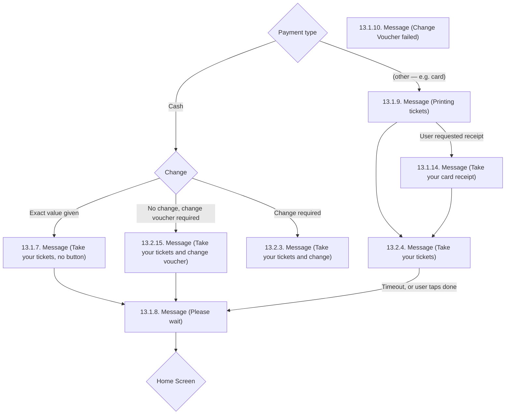

# Flow: Translink TVM — Ticket Printing

- Source: `knowledge/flows/translink-tvm-full-transcription-v3.4.4.md`, board "12. Ticket Printing"
  (Overflow project "TVM", https://overflow.io/s/08CCGD4Q/). Transcribed verbatim via the Claude
  Chrome extension, source dated 2026 (v3.4.4 export); structured into this flow-map 2026-08-05.
- Project: translink   Device: TVM   Feature: ticket printing / dispensing (post-payment collection)
- Transcription confidence: **medium** — the board's screen list (8) exceeds the annotation list
  (6) and the connections do not exhaustively wire every screen (see Notes/unknowns); the wiring
  that IS given is transcribed verbatim.

## Diagram

## Paths (each path = one candidate scenario)
| # | Path | Feature | Tags | Covered by |
|---|------|---------|------|------------|
| 1 | Payment type: Cash → Change: exact value given → Take your tickets (no button) → Please wait → Home Screen | ticket-printing | — | 4103675 (Smoke — basic single ticket, cash) |
| 2 | Payment type: Cash → Change: no change, change voucher required → Take your tickets and change voucher → Please wait → Home Screen | ticket-printing | — | 4103653, 4103654, 4103783 |
| 3 | Payment type: Cash → Change: change required → Take your tickets and change (**TODO: no onward connection captured from this screen — see Notes**) | ticket-printing | — | 4103675 |
| 4 | Payment type: other (e.g. card) → Printing tickets → user requests receipt → Take your card receipt → Take your tickets → Please wait (timeout/done) → Home Screen | ticket-printing | @bos | 4103672, 4103676 |
| 5 | Payment type: other (e.g. card) → Printing tickets → (no receipt requested) → Take your tickets → Please wait (timeout/done) → Home Screen | ticket-printing | — | 4103676 |
| 6 | Change voucher fails to print → Change Voucher failed error screen (**TODO: no connection into or out of this screen captured**) | ticket-printing | @destructive | 4105390 |

## Screen states (Given/Then anchors)
- **13.1.9. Message (Printing tickets)** — reached directly from the "Payment type" decision for
  the non-cash branch; tickets are printing.
- **13.1.14. Message (Take your card receipt)** — "This screen shows when a card receipt has been
  requested." Annotation notes the synthesized speech "Speech 9 – Please take your debit or credit
  card" plays somewhere in this board (**TODO: confirm which screen this speech line is actually
  tied to — the transcription lists it among this board's annotations without pinning it to a
  specific screen**).
- **13.1.7. Message (Take your tickets, no button)** — reached when Change resolves to "Exact value
  given" (no change owed). Annotation "Speech 11 – Please take your tickets" appears in this board's
  annotation list (**TODO: confirm exact screen attribution**, see above).
- **13.2.3. Message (Take your tickets and change)** — reached when Change resolves to "Change
  required". Annotation "Speech 13 – Please remember to take your change" is listed for this board
  (**TODO: confirm exact screen attribution**).
- **13.2.15. Message (Take your tickets and change voucher)** — reached when Change resolves to "No
  change, change voucher required".
- **13.2.4. Message (Take your tickets)** — reached from Printing tickets (directly, or via the
  card-receipt screen). Leads onward to Please wait on "Timeout, or user taps done".
- **13.1.8. Message (Please wait)** — common landing point before the flow returns via the "Home
  Screen" decision; fed by 13.1.7, 13.2.15, and 13.2.4.
- **13.1.10. Message (Change Voucher failed)** — "This is the error screen for if the change voucher
  fails to print." No incoming or outgoing connection is captured in the source for this screen
  (see Notes/unknowns).

## Notes / unknowns
- TODO: confirm the onward connection (if any) from **13.2.3. Message (Take your tickets and
  change)** — the source's Connections/Flow list only shows the incoming edge from the "Change"
  decision; no outgoing edge to Please wait or elsewhere is transcribed, unlike the other two
  "Change" branches which both explicitly route to 13.1.8.
- TODO: confirm where **13.1.10. Message (Change Voucher failed)** sits in the flow — it's listed
  among this board's 8 screens and has an annotation explaining its purpose, but zero connections
  (in or out) are transcribed for it. Likely branches off the change-voucher path (13.2.15) on
  print failure, but that link is not stated in the source and must not be invented.
- TODO: confirm the exact trigger label for the "other" branch out of the "Payment type" decision —
  the source only gives one explicit branch label ("Cash") for this decision; the second edge
  (`Decision: "Payment type" → Screen: "13.1.9. Message (Printing tickets)"`) carries no condition
  text in the transcription, so "(other — e.g. card)" here is an inferred description of the
  untaken-cash branch, not a verbatim label.
- The 6 annotations transcribed for this board do not map 1:1 to the 8 screens by position in the
  source; attribution above is a best-effort inference and several are flagged TODO rather than
  stated as fact.
- This board (12. Ticket Printing) reads as a single cohesive feature area — the post-payment
  ticket/change/receipt dispensing sequence — so it was kept as one file rather than split, unlike
  ETM's FLU/Driver Menu boards which bundled genuinely distinct feature areas.
