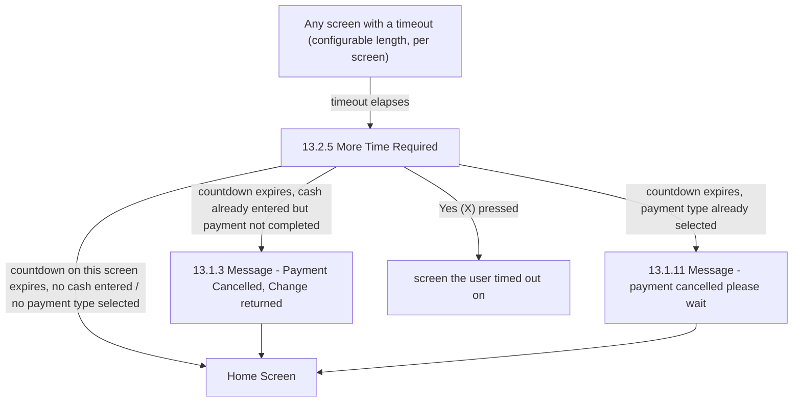

# Flow: Translink TVM — Timeouts

- Source: `knowledge/flows/translink-tvm-full-transcription-v3.4.4.md`, board "14. Timeouts".
  Transcribed/structured 2026-08-05.
- Project: translink   Device: TVM   Feature: timeouts (idle/inactivity handling on payment screens)
- Transcription confidence: **medium** — the source board lists 0 Decision Points and 0 explicit
  Connections/Flow entries; the sequence below is reconstructed from the board's 3 Annotations /
  Spec Notes (prose), not from explicit connection arrows. See Notes/unknowns.

## Diagram

## Paths (each path = one candidate scenario)
| # | Path | Feature | Tags | Covered by |
|---|------|---------|------|------------|
| 1 | Any screen times out → More Time Required → "Yes (X)" pressed → returns to the screen timed out on | timeouts | — | 4105391 |
| 2 | Any screen times out → More Time Required → countdown expires (no cash entered, no payment type selected) → Home Screen | timeouts | — | 4105392 |
| 3 | Any screen times out → More Time Required → countdown expires, cash already entered but payment not completed → Payment Cancelled (Change returned) → Home Screen | timeouts | @destructive | 4105393 |
| 4 | Any screen times out → More Time Required → countdown expires, payment type already selected → payment cancelled please wait → Home Screen | timeouts | @destructive | 4105394 |

## Screen states (Given/Then anchors)
- **13.2.5 More Time Required** — shown after any screen's configurable timeout elapses. Offers a
  "Yes (X)" option to resume; if not pressed before its own countdown ends, the TVM returns to the
  Home Screen (directly, or via one of the two cancellation messages below depending on how far the
  transaction had progressed).
- **13.1.3 Message (Payment Cancelled - Change returned)** — shown after More Time Required's
  countdown, when the user had already entered some cash but not yet completed payment; TVM then
  returns to the Home Screen.
- **13.1.11 Message (payment cancelled please wait)** — shown after More Time Required's countdown,
  when the user had already selected a payment type; TVM then returns to the Home Screen.

## Notes / unknowns
- The source board's own "Decision Points" and "Connections / Flow" counts are both 0 — no explicit
  decision nodes or connection arrows were captured for this board in Overflow. The diagram and
  paths above are reconstructed from the board's 3 free-text Annotations/Spec Notes, not from
  transcribed connection lines.
- TODO: confirm which of the two post-More-Time-Required screens (Payment Cancelled - Change
  returned vs. payment cancelled please wait) pairs with which precondition. The annotations
  describe the two conditions ("cash entered but not completed" vs "payment type already selected")
  in the same order as the two screens are listed on the board, and this file maps them 1:1 in that
  order — but the source text never names the screen inside either annotation, so this pairing is
  inferred, not verbatim.
- TODO: confirm the exact timeout durations per screen — the annotation says the length is
  "configurable per screen" but does not state values; none were captured in this board.
- TODO: confirm whether every screen across the TVM flow genuinely has this timeout behaviour, or
  only a subset — the annotation says "All screens have a timeout" but this board only lists 3
  screens (the timeout-handling screens themselves), not the full set of screens the behaviour
  applies to.
